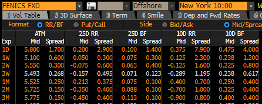

.. _c-fx-smile-doc:

.. ipython:: python
   :suppress:

   import warnings
   warnings.filterwarnings('always')
   from rateslib.solver import *
   from rateslib.instruments import *
   from rateslib.fx_volatility import FXDeltaVolSmile, FXDeltaVolSurface
   import matplotlib.pyplot as plt
   from datetime import datetime as dt
   import numpy as np
   from pandas import DataFrame

*********************************
FX Vol Surfaces
*********************************

.. warning::

   FX volatility products in *rateslib* are not in stable status. Their API and/or object
   interactions *may* incur breaking changes in upcoming releases as they mature and other
   classes or pricing models may be added.

The ``rateslib.fx_volatility`` module includes classes for *Smiles* and *Surfaces*
which can be used to price *FX Options* and *FX Option Strategies*.

.. autosummary::
   rateslib.fx_volatility.FXDeltaVolSmile
   rateslib.fx_volatility.FXDeltaVolSurface

Introduction and FX Volatility Smiles
*************************************

The *FXDeltaVolSmile* is parametrised by a series of *(delta, vol)* node points
interpolated by a cubic spline. This interpolation is automatically constructed with knot
sequences that adjust to the number of given ``nodes``. One node will create a constant
vol level, and two nodes will create a straight line gradient. More nodes (appropriately calibrated)
will create a traditional smile shape.

An *FXDeltaVolSmile* must also be initialised with an ``eval_date`` which serves the same
purpose as the initial node point on a *Curve*, and indicates *'today'*. There must also be an ``expiry``, and
options priced with this *Smile* must have an equivalent expiry or errors will be raised.
Finally, the ``delta_type`` of the *Smile* must be specified so that its delta index is well
defined.

Constructing a Smile
*********************

The following data describes *Instruments* to calibrate the EURUSD FX volatility surface on 7th May 2024.
We will take a cross-section of this data, at the 3-week expiry (28th May 2024), and create an *FXDeltaVolSmile*.

Since EURUSD is **not** premium adjusted and the premium currency is USD we will match the *Smile* with this
definition and set it to a ``delta_type`` of *'spot'*, matching the market convention of these quoted instruments.
Since we have 5 calibrating instruments we require 5 degrees of freedom.

.. ipython:: python

   smile = FXDeltaVolSmile(
       nodes={
           0.10: 10.0,
           0.25: 10.0,
           0.50: 10.0,
           0.75: 10.0,
           0.90: 10.0,
       },
       eval_date=dt(2024, 5, 7),
       expiry=dt(2024, 5, 28),
       delta_type="spot",
       id="eurusd_3w_smile"
   )

The above *Smile* is initialised as a flat vol at 10%. In order to calibrate it we need to create the pricing
instruments, given in the market prices data table.

Since these *Instruments* are **multi-currency derivatives** an :class:`~rateslib.fx.FXForwards`
framework also needs to be setup for pricing. We will do this simultaneously using other prevailing market data,
i.e. local currency interest rates at 3.90% and 5.32%, and an FX Swap rate at 8.85 points.

.. ipython:: python

   # Define the interest rate curves for EUR, USD and X-Ccy basis
   eureur = Curve({dt(2024, 5, 7): 1.0, dt(2024, 5, 30): 1.0}, calendar="tgt", id="eureur")
   eurusd = Curve({dt(2024, 5, 7): 1.0, dt(2024, 5, 30): 1.0}, id="eurusd")
   usdusd = Curve({dt(2024, 5, 7): 1.0, dt(2024, 5, 30): 1.0}, calendar="nyc", id="usdusd")
   # Create an FX Forward market with spot FX rate data
   fxf = FXForwards(
       fx_rates=FXRates({"eurusd": 1.0760}, settlement=dt(2024, 5, 9)),
       fx_curves={"eureur": eureur, "usdusd": usdusd, "eurusd": eurusd},
   )
   # Setup the Solver instrument calibration for rates Curves and vol Smiles
   option_args=dict(
       pair="eurusd", expiry=dt(2024, 5, 28), calendar="tgt", delta_type="spot",
       curves=[None, "eurusd", None, "usdusd"], vol="eurusd_3w_smile"
   )
   solver = Solver(
       curves=[eureur, eurusd, usdusd, smile],
       instruments=[
           IRS(dt(2024, 5, 9), "3W", spec="eur_irs", curves="eureur"),
           IRS(dt(2024, 5, 9), "3W", spec="usd_irs", curves="usdusd"),
           FXSwap(dt(2024, 5, 9), "3W", pair="eurusd", curves=[None, "eurusd", None, "usdusd"]),
           FXStraddle(strike="atm_delta", **option_args),
           FXRiskReversal(strike=["-25d", "25d"], **option_args),
           FXRiskReversal(strike=["-10d", "10d"], **option_args),
           FXBrokerFly(strike=["-25d", "atm_delta", "25d"], **option_args),
           FXBrokerFly(strike=["-10d", "atm_delta", "10d"], **option_args),
       ],
       s=[3.90, 5.32, 8.85, 5.493, -0.157, -0.289, 0.071, 0.238],
       fx=fxf,
   )
   smile.plot()

.. container:: twocol

   .. container:: leftside50

      .. plot::
         :caption: Rateslib Vol Smile

         from rateslib.curves import Curve
         from rateslib.instruments import *
         from rateslib.fx_volatility import FXDeltaVolSmile
         from rateslib.fx import FXRates, FXForwards
         from rateslib.solver import Solver
         import matplotlib.pyplot as plt
         from datetime import datetime as dt
         smile = FXDeltaVolSmile(
             nodes={
                 0.10: 10.0,
                 0.25: 10.0,
                 0.50: 10.0,
                 0.75: 10.0,
                 0.90: 10.0,
             },
             eval_date=dt(2024, 5, 7),
             expiry=dt(2024, 5, 28),
             delta_type="spot",
             id="eurusd_3w_smile"
         )
         # Define the interest rate curves for EUR, USD and X-Ccy basis
         eureur = Curve({dt(2024, 5, 7): 1.0, dt(2024, 5, 30): 1.0}, calendar="tgt", id="eureur")
         eurusd = Curve({dt(2024, 5, 7): 1.0, dt(2024, 5, 30): 1.0}, id="eurusd")
         usdusd = Curve({dt(2024, 5, 7): 1.0, dt(2024, 5, 30): 1.0}, calendar="nyc", id="usdusd")
         # Create an FX Forward market with spot FX rate data
         fxf = FXForwards(
             fx_rates=FXRates({"eurusd": 1.0760}, settlement=dt(2024, 5, 9)),
             fx_curves={"eureur": eureur, "usdusd": usdusd, "eurusd": eurusd},
         )
         # Setup the Solver instrument calibration for rates Curves and vol Smiles
         option_args=dict(
             pair="eurusd", expiry=dt(2024, 5, 28), calendar="tgt", delta_type="spot",
             curves=[None, "eurusd", None, "usdusd"], vol="eurusd_3w_smile"
         )
         solver = Solver(
             curves=[eureur, eurusd, usdusd, smile],
             instruments=[
                 IRS(dt(2024, 5, 9), "3W", spec="eur_irs", curves="eureur"),
                 IRS(dt(2024, 5, 9), "3W", spec="usd_irs", curves="usdusd"),
                 FXSwap(dt(2024, 5, 9), "3W", currency="eur", leg2_currency="usd", curves=[None, "eurusd", None, "usdusd"]),
                 FXStraddle(strike="atm_delta", **option_args),
                 FXRiskReversal(strike=["-25d", "25d"], **option_args),
                 FXRiskReversal(strike=["-10d", "10d"], **option_args),
                 FXBrokerFly(strike=["-25d", "atm_delta", "25d"], **option_args),
                 FXBrokerFly(strike=["-10d", "atm_delta", "10d"], **option_args),
             ],
             s=[3.90, 5.32, 8.85, 5.493, -0.157, -0.289, 0.071, 0.238],
             fx=fxf,
         )
         fig, ax, line = smile.plot()
         plt.show()
         plt.close()

   .. container:: rightside50

      |
      |

      .. figure:: _static/fx_eurusd_3w_smile.PNG
         :alt: BBG FENICS EURUSD Smile on 7th May 2024
         :width: 320

         BBG Fenics Vol Smile

      |
      |

FX Volatility Surfaces
**********************

*FX Surfaces* in *rateslib* are collections of cross-sectional *FX Smiles* where:

- each cross-sectional *Smile* will represent a *Smile* at that explicit *expiry*,
- the *delta type* and the *delta indexes* on each cross-sectional *Smile* are the same,
- each *Smile* has its own calibrated node values,
- *Smiles* for *expiries* that do not pre-exist are generated with an interpolation
  scheme that uses linear total variance, which is equivalent to flat-forward volatility

To demonstrate this, we will use an example adapted from Iain Clark's *Foreign Exchange
Option Pricing: A Practitioner's Guide*.

The ``eval_date`` is fictionally assumed to be 3rd May 2009 and the FX spot rate is 1.34664,
and the continuously compounded EUR and USD rates are 1.0% and 0.4759..% respectively. With these
we will be able to closely match his values for option strikes.

.. ipython:: python

   # Setup the FXForward market...
   eur = Curve({dt(2009, 5, 3): 1.0, dt(2011, 5, 10): 1.0})
   usd = Curve({dt(2009, 5, 3): 1.0, dt(2011, 5, 10): 1.0})
   fxf = FXForwards(
       fx_rates=FXRates({"eurusd": 1.34664}, settlement=dt(2009, 5, 5)),
       fx_curves={"eureur": eur, "usdusd": usd, "eurusd": eur},
   )
   solver = Solver(
       curves=[eur, usd],
       instruments=[
           Value(dt(2009, 5, 4), curves=eur, metric="cc_zero_rate"),
           Value(dt(2009, 5, 4), curves=usd, metric="cc_zero_rate")
       ],
       s=[1.00, 0.4759550366220911],
       fx=fxf,
   )

His *Table 4.2* is shown below, which outlines the delta type of the used instruments at their respective tenors,
and the ATM-delta straddle, the 25-delta broker-fly and the 25-delta risk reversal market volatility prices.

.. ipython:: python

   data = DataFrame(
       data = [["spot", 18.25, 0.95, -0.6], ["forward", 17.677, 0.85, -0.562]],
       index=["1y", "2y"],
       columns=["Delta Type", "ATM", "25dBF", "25dRR"],
   )
   data

Constructing a Surface
**********************

We will now create a *Surface* that will be calibrated by those given rates.
The *Surface* is initialised at a flat 18% volatility.

.. ipython:: python

   surface = FXDeltaVolSurface(
       eval_date=dt(2009, 5, 3),
       delta_indexes=[0.25, 0.5, 0.75],
       expiries=[dt(2010, 5, 3), dt(2011, 5, 3)],
       node_values=np.ones((2, 3))* 18.0,
       delta_type="forward",
       id="surface",
   )

The calibration of the *Surface* requires a *Solver* that will iterate and update the surface
node values until convergence with the given instrument rates.

.. note::

   The *Surface* is
   parametrised by a *'forward'* *delta type* but that the 1Y *Instruments* use *'spot'*.
   Internally this is all handled appropriately with necessary conversions, but it is the users
   responsibility to label the *Surface* and *Instrument* with the correct types. As Clark and
   others highlight "failing to take [correct delta types] into account introduces a mismatch -
   large enough to be relevant for calibration and pricing, but small enough that it may not be
   noticed at first". Parametrising the *Surface* with a *'forward'* delta type is the **recommended**
   choice because it is more standardised and the configuration of which *delta types* to use for
   the *Instruments* can be a separate consideration.

   For performance reasons it is recommended to match unadjusted delta type *Surfaces* with
   calibrating *Instruments* that also have unadjusted delta types. And vice versa with premium adjusted
   delta types. However, *rateslib* has internal root solvers which can handle these cross-delta type
   specifications, although it degrades the performance of the *Solver* because the calculations are more
   difficult. Mixing 'spot' and 'forward' is not a difficult distinction to refactor and that does
   not cause performance degradation.

.. ipython:: python

   fx_args_0 = dict(
       pair="eurusd",
       curves=[None, eur, None, usd],
       expiry=dt(2010, 5, 3),
       delta_type="spot",
       vol="surface",
   )
   fx_args_1 = dict(
       pair="eurusd",
       curves=[None, eur, None, usd],
       expiry=dt(2011, 5, 3),
       delta_type="forward",
       vol="surface",
   )

   solver = Solver(
       surfaces=[surface],
       instruments=[
           FXStraddle(strike="atm_delta", **fx_args_0),
           FXBrokerFly(strike=["-25d", "atm_delta", "25d"], **fx_args_0),
           FXRiskReversal(strike=["-25d", "25d"], **fx_args_0),
           FXStraddle(strike="atm_delta", **fx_args_1),
           FXBrokerFly(strike=["-25d", "atm_delta", "25d"], **fx_args_1),
           FXRiskReversal(strike=["-25d", "25d"], **fx_args_1),
       ],
       s=[18.25, 0.95, -0.6, 17.677, 0.85, -0.562],
       fx=fxf,
   )

Clark's Table 4.5 is replicated here. Note that due to using a different parametric form for
*Smiles* (i.e. a natural cubic spline), inferring his FX forwards market rates, and not necessarily
knowing the exact dates and holiday calendars, this produces
minor deviations from his calculated values.

.. ipython:: python
   :suppress:

   args = dict(
       pair="eurusd",
       curves=[None, eur, None, usd],
       vol=surface,
       delta_type="forward"
   )

   ops = [
       FXPut(strike="-25d", expiry=dt(2010, 5, 3), **args),
       FXPut(strike="atm_delta", expiry=dt(2010, 5, 3), **args),
       FXCall(strike="25d", expiry=dt(2010, 5, 3), **args),
       FXPut(strike="-25d", expiry=dt(2010, 11, 3), **args),
       FXPut(strike="atm_delta", expiry=dt(2010, 11, 3), **args),
       FXCall(strike="25d", expiry=dt(2010, 11, 3), **args),
       FXPut(strike="-25d", expiry=dt(2011, 5, 3), **args),
       FXPut(strike="atm_delta", expiry=dt(2011, 5, 3), **args),
       FXCall(strike="25d", expiry=dt(2011, 5, 3), **args),
   ]
   for op in ops:
       op.rate(fx=fxf)

   strikes = [float(_._pricing["k"]) for _ in ops]
   vols = [float(_._pricing["vol"]) for _ in ops]
   data2 = DataFrame(
       data=[strikes[0:3], vols[0:3], strikes[3:6], vols[3:6], strikes[6:9], vols[6:9]],
       index=[("1y", "k"), ("1y", "vol"), ("18m", "k"), ("18m", "vol"), ("2y", "k"), ("2y", "vol")],
       columns=["25d Put", "ATM Put", "25d Call"]
   )

.. ipython:: python

   data2

Plotting
*********

A full 3D surface plot is not yet available but a few cross-sections can be plotted together.
Here, the three relevant *Smiles* from above are plotted.

.. ipython:: python

   sm12 = surface.smiles[0]
   sm18 = surface.get_smile(dt(2010, 11, 3))
   sm24 = surface.smiles[1]
   sm12.plot(comparators=[sm18, sm24], labels=["1y", "18m", "2y"])

.. plot::

   from rateslib.curves import Curve
   from rateslib.solver import Solver
   from rateslib.fx import FXForwards, FXRates
   from rateslib.instruments import FXStraddle, FXRiskReversal, FXBrokerFly, Value
   from rateslib.fx_volatility import FXDeltaVolSmile, FXDeltaVolSurface
   from datetime import datetime as dt
   from matplotlib import pyplot as plt
   eur = Curve({dt(2009, 5, 3): 1.0, dt(2011, 5, 10): 1.0})
   usd = Curve({dt(2009, 5, 3): 1.0, dt(2011, 5, 10): 1.0})
   fxf = FXForwards(
       fx_rates=FXRates({"eurusd": 1.34664}, settlement=dt(2009, 5, 5)),
       fx_curves={"eureur": eur, "usdusd": usd, "eurusd": eur},
   )
   solver = Solver(
       curves=[eur, usd],
       instruments=[
           Value(dt(2009, 5, 4), curves=eur, metric="cc_zero_rate"),
           Value(dt(2009, 5, 4), curves=usd, metric="cc_zero_rate")
       ],
       s=[1.00, 0.4759550366220911],
       fx=fxf,
   )
   surface = FXDeltaVolSurface(
       eval_date=dt(2009, 5, 3),
       delta_indexes=[0.25, 0.5, 0.75],
       expiries=[dt(2010, 5, 3), dt(2011, 5, 3)],
       node_values=np.ones((2, 3))* 18.0,
       delta_type="forward",
       id="surface",
   )
   fx_args_0 = dict(
       pair="eurusd",
       curves=[None, eur, None, usd],
       expiry=dt(2010, 5, 3),
       delta_type="spot",
       vol="surface",
   )
   fx_args_1 = dict(
       pair="eurusd",
       curves=[None, eur, None, usd],
       expiry=dt(2011, 5, 3),
       delta_type="forward",
       vol="surface",
   )

   solver = Solver(
       surfaces=[surface],
       instruments=[
           FXStraddle(strike="atm_delta", **fx_args_0),
           FXBrokerFly(strike=["-25d", "atm_delta", "25d"], **fx_args_0),
           FXRiskReversal(strike=["-25d", "25d"], **fx_args_0),
           FXStraddle(strike="atm_delta", **fx_args_1),
           FXBrokerFly(strike=["-25d", "atm_delta", "25d"], **fx_args_1),
           FXRiskReversal(strike=["-25d", "25d"], **fx_args_1),
       ],
       s=[18.25, 0.95, -0.6, 17.677, 0.85, -0.562],
       fx=fxf,
   )
   sm12 = surface.smiles[0]
   sm18 = surface.get_smile(dt(2010, 11, 3))
   sm24 = surface.smiles[1]
   fig, ax, lines = sm12.plot(comparators=[sm18, sm24], labels=["1y", "18m", "2y"])
   plt.show()
   plt.close()
