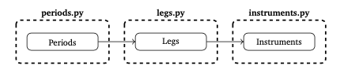

.. _instruments-toc-doc:

************
Instruments
************

*Instruments* in *rateslib* are generally categorised into the following
groups:

- :ref:`Securities<securities-doc>`, which are single currency based, like *Bonds* and *Bills*.
- :ref:`Single Currency Derivatives<singlecurrency-doc>`, like *Interest Rate Swaps (IRS)*, *FRAs*,
  *Inflation Swaps (ZCISs)*.
- :ref:`Multi-Currency Derivatives<multicurrency-doc>`, like *FXSwaps* and *Cross-Currency Swaps (XCSs)*.
- :ref:`FX Volatility Derivatives<fx-volatility-doc>`, like *FXCalls*, *FXPuts* and *FXStraddles*.
- :ref:`Utilities and Instrument Combinations<combinations-doc>`, which allows things like *Spread trades*,
  *Butterflies*, *Portfolios* and a *Value* for a *Curve*.

Each *Instrument* is its own Python *Class*, and it is sequentially constructed from other classes.

- First :ref:`Periods<periods-doc>` are defined in the ``rateslib.periods`` module.
- Secondly :ref:`Legs<legs-doc>` are defined in the ``rateslib.legs`` module and these
  combine and control a list of organised :ref:`Periods<periods-doc>`.
- Finally *Instruments* are defined in the
  ``rateslib.instruments`` module and these combine and control one or two
  :ref:`Legs<legs-doc>`.

It is recommended to review the documentation in the above order, since the
composited objects are more explicit in their documentation of each parameter.

Users are expected to rarely use :ref:`Periods<periods-doc>` or
:ref:`Legs<legs-doc>` directly but they are exposed in the public API in order
to construct custom objects.

.. toctree::
    :hidden:
    :maxdepth: 2

    d_periods.rst
    d_legs.rst
    e_securities.rst
    e_singlecurrency.rst
    e_multicurrency.rst
    e_fx_volatility.rst
    e_combinations.rst

The below example demonstrates this composition when creating an :class:`~rateslib.instruments.IRS`.

.. ipython:: python

   irs = IRS(dt(2022, 1, 1), "1Y", "S")
   # The IRS contains 2 Leg attributes.
   irs.leg1
   irs.leg2
   # Each leg contains a list of Periods.
   irs.leg1.periods
   irs.leg2.periods
