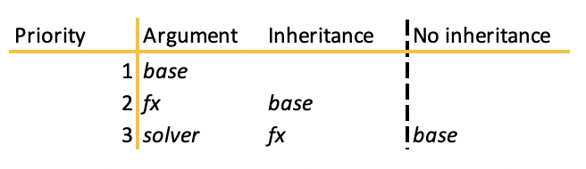

.. _mechanisms-doc:

******************
Pricing Mechanisms
******************

This guide is aimed at users who are not completely new to rateslib and who have a little
experience already building *Instruments*, *Curves* and *Solvers* are are familiar with some
of its basic mechanics already.

Summary
**************************

*Rateslib's* API design for valuing and obtaining risk sensitivities of *Instruments*
follows the first two :ref:`pillars of its design philosophy:<pillars-doc>`

- Maximise flexibility : minimise user input,
- Prioritise risk sensitivities above valuation.

This means the arguments required for the
:meth:`Instrument.npv()<rateslib.instruments.BaseMixin.npv>`,
:meth:`Instrument.delta()<rateslib.instruments.Sensitivities.delta>` and
:meth:`Instrument.gamma()<rateslib.instruments.Sensitivities.gamma>`
are the same and optionally require:

``curves``, ``solver``, ``fx``, ``base``, ``local``

When calculating risk metrics a ``solver``, which contains derivative mapping information, is
required. However, when calculating value, it is sufficient to just provide ``curves``. In this
case, and if the *curves* do not contain AD then the calculation might be upto 300% faster.

Since these arguments are optional and can be inferred from each other it is important to
understand the combination that can produce results. There are two sections on this page which
discuss these combinations.

1) How ``solver``, ``fx``, ``base`` and ``local`` interact? I.e. what currency will results be displayed in?
2) How ``curves``, ``solver`` and *Instruments* interact? I.e. which *Curves* will be used to price which *Instruments*?

.. _base-fx-doc:

How do ``solver``, ``fx``, ``base`` and ``local`` interact?
*************************************************************

One of the most important aspects to keep track of when valuing
:meth:`Instrument.npv()<rateslib.instruments.BaseMixin.npv>` is that
of the currency in which it is displayed. This is the ``base``
currency it is displayed in. *base* does not need to
be explicitly set to get the results one expects.

**The local argument**

``local`` can, at any time, be set to *True* and this will return a dict
containing a currency key and a value. By using this we keep track
of the currency of each *Leg* of the *Instrument*. This is important for
risk sensitivities and is used internally, especially for multi-currency instruments.

.. ipython:: python

   curve = Curve({dt(2022, 1, 1): 1.0, dt(2023, 1, 1): 0.96}, id="curve")
   fxr = FXRates({"usdeur": 0.9, "gbpusd": 1.25}, base="gbp", settlement=dt(2022, 1, 3))
   fxf = FXForwards(
       fx_rates=fxr,
       fx_curves={"usdusd": curve, "eureur": curve, "gbpgbp": curve, "eurusd": curve, "gbpusd": curve},
       base="eur",
   )
   solver = Solver(
       curves=[curve],
       instruments=[IRS(dt(2022, 1, 1), "1y", "a", curves=curve)],
       s=[4.109589041095898],
       fx=fxf,
   )

The below shows the use of the ``local`` argument to get the PV of both *Legs* on this *XCS*
separately in each currency.
When specifying a ``base`` and setting ``local`` to *False* the PV of the *Legs* are aggregated
and converted to the given currency.

.. ipython:: python

   nxcs = XCS(dt(2022, 2, 1), "6M", "A", currency="eur", leg2_currency="usd", leg2_mtm=False)
   nxcs.npv(curves=[curve]*4, fx=fxf, local=True)
   nxcs.npv(curves=[curve]*4, fx=fxf, base="usd")

What is best practice?
------------------------

For single currency *Instruments*, if you want to return an *npv* value in its local currency
then you do **not** need to supply ``base`` or ``fx`` arguments. However, to
be explicit, *base* can also be specified.

.. ipython:: python

   irs = IRS(dt(2022, 2, 1), "6M", "A", currency="usd", fixed_rate=4.0, curves=curve)
   irs.npv(solver=solver)              # USD is local currency default, solver.fx.base is EUR.
   irs.npv(solver=solver, base="usd")  # USD is explicit, solver.fx.base is EUR.

To calculate a value in another non-local currency supply an ``fx`` object and
specify the ``base``. It is **not** good practice to supply *fx* as numeric since this
can result in errors (if the exchange rate is given the wrong way round (human error))
and it does not preserve AD or any FX sensitivities. *base* is inferred from the
*fx* object so the following are all equivalent. *fx* objects are commonly inherited from
*solvers*.

.. ipython:: python

   irs.npv(fx=fxr)                     # GBP is fx's base currency
   irs.npv(fx=fxr, base="gbp")         # GBP is explicitly specified
   irs.npv(fx=fxr, base=fxr.base)      # GBP is fx's base currency
   irs.npv(solver=solver, base="gbp")  # GBP is explicitly specified

For multi-currency *Instruments*, which include *FXSwaps*, *FXExchanges* and *XCSs*, these
instruments typically rely on an *FXForwards* object to value correctly, in which case that will be
supplied either via ``solver`` or via the ``fx`` argument. ``base`` can be set explicitly,
or set as the same as ``fx.base``, or it will be taken as the local *Leg1* currency.

Technical rules
-----------------

If ``base`` is not given it will be inferred from one of two objects;

- either it will be inferred from the provided ``fx`` object,
- or it will be inferred from the *Leg* or from *Leg1* of an *Instrument*.

``base`` will **not** be inherited from a second layer inherited object. I.e. ``base``
will not be set equal to the base currency of the ``solver.fx`` associated object.

.. list-table:: Possible argument combinations supplied and rateslib return.
   :widths: 66 5 5 12 12
   :header-rows: 1

   * - **Case and Output**
     - ``base``
     - ``fx``
     - ``solver`` with *fx*
     - ``solver`` without *fx*
   * - ``base`` **is explicit**
     -
     -
     -
     -
   * - Returns if *currency* and ``base`` are available in ``fx`` object, otherwise
       raises.
     - X
     - X
     -
     -
   * - Returns and warns about best practice.
     - X
     - (numeric)
     -
     -
   * - Returns if *currency* and ``base`` are available in ``fx`` object, otherwise
       raises.
     - X
     -
     - X
     -
   * - Returns if *currency* and ``base`` are available in ``fx`` object, otherwise
       raises. Will warn if ``fx`` and ``solver.fx`` are not the same object.
     - X
     - X
     - X
     -
   * - Returns if ``base`` aligns with local currency, else raises.
     - X
     -
     -
     -
   * - Returns if ``base`` aligns with local currency, else raises.
     - X
     -
     -
     - X
   * - ``base`` **is inferred** and logic reverts to above cases.
     -
     -
     -
     -
   * - Returns inferring ``base`` from ``fx`` object.
     - <-
     - X
     -
     -
   * - Returns inferring ``base`` from ``fx`` object. Warns if ``fx`` and
       ``solver.fx`` are not the same object.
     - <-
     - X
     - X
     -
   * - Returns inferring ``base`` from ``fx`` object.
     - <-
     - X
     -
     - X
   * - Returns inferring ``base`` as *Leg* or *Leg1* local currency.
     - (local)
     -
     - X
     -
   * - Returns inferring ``base`` as *Leg* or *Leg1* local currency.
     - (local)
     -
     -
     - X
   * - Returns inferring ``base`` as *Leg* or *Leg1* local currency.
     - (local)
     -
     -
     -

Examples
----------

We continue the examples above using the USD IRS created and consider possible *npvs*:

.. ipython:: python

   def npv(irs, curves=NoInput(0), solver=NoInput(0), fx=NoInput(0), base=NoInput(0)):
      try:
         _ = irs.npv(curves, solver, fx, base)
      except Exception as e:
         _ = str(e)
      return _

.. ipython:: python
   :okwarning:

   # The following are all explicit EUR output
   npv(irs, base="eur")          # Error since no conversion rate available.
   npv(irs, base="eur", fx=fxr)  # Takes 0.9 FX rate from object.
   npv(irs, base="eur", fx=2.0)  # UserWarning and no fx Dual sensitivities.
   npv(irs, base="eur", solver=solver)  # Takes 0.95 FX rates from solver.fx
   npv(irs, base="eur", fx=fxr, solver=solver)  # Takes 0.9 FX rate from fx

   # The following infer the base
   npv(irs)                         # Base is inferred as local currency: USD
   npv(irs, fx=fxr)                 # Base is inferred from fx: GBP
   npv(irs, fx=fxr, base=fxr.base)  # Base is explicit from fx: GBP
   npv(irs, fx=fxr, solver=solver)  # Base is inferred from fx: GBP. UserWarning for different fx objects
   npv(irs, solver=solver)          # Base is inferred as local currency: USD
   npv(irs, solver=solver, fx=solver.fx)  # Base is inferred from solver.fx: EUR

.. _mechanisms-curves-doc:

How ``curves``, ``solver`` and *Instruments* interact?
********************************************************

The pricing mechanisms in *rateslib* require :ref:`Instruments<instruments-toc-doc>` and
:ref:`Curves<c-curves-doc>`. :ref:`FX<fx-doc>` objects
(usually :class:`FXForwards<rateslib.fx.FXForwards>`) may also be required
(for multi-currency instruments), and these
are all often interdependent and calibrated by a :ref:`Solver<c-solver-doc>`.

Since *Instruments* are separate objects to *Curves* and *Solvers*, when pricing them it requires
a mapping to link them all together. This leads to...

**Three different modes of initialising an** *Instrument*:

1) **Dynamic - Price Time Mapping**: this means an *Instrument* is initialised without any
   ``curves`` and these must be provided later at price time, usually inside a function call.

   .. ipython:: python

      instrument = IRS(dt(2022, 1, 1), "10Y", "A", fixed_rate=2.5)
      curve = Curve({dt(2022, 1, 1): 1.0, dt(2032, 1, 1): 0.85})
      instrument.npv(curves=curve)
      instrument.rate(curves=curve)

2) **Explicit - Immediate Mapping**: this means an *Instrument* is initialised
   with ``curves`` and this object will be used if no *Curves* are provided at price time.
   The *Curves* must already exist when initialising the *Instrument*.

   .. ipython:: python

      curve = Curve({dt(2022, 1, 1): 1.0, dt(2032, 1, 1): 0.85})
      instrument = IRS(dt(2022, 1, 1), "10Y", "A", fixed_rate=2.5, curves=curve)
      instrument.npv()
      instrument.rate()

3) **Indirect - String** ``id`` **Mapping**: this means an *Instrument* is initialised
   with ``curves`` that contain lookup information to collect the *Curves* at price time
   from a ``solver``.

   .. ipython:: python

      instrument = IRS(dt(2022, 1, 1), "10Y", "A", fixed_rate=2.5, curves="curve-id")
      curve = Curve({dt(2022, 1, 1): 1.0, dt(2032, 1, 1): 0.85}, id="curve-id")
      solver = Solver(
          curves=[curve],
          instruments=[IRS(dt(2022, 1, 1), "10Y", "A", curves=curve)],
          s=[1.6151376354769178]
      )
      instrument.npv(solver=solver)
      instrument.rate(solver=solver)

Then, for price time, this then also leads to the following cases...

**Two modes of pricing an** *Instrument*:

1) **Direct Curves Override**:  if ``curves`` are given dynamically these are used regardless of
   which initialisation mode was used for the *Instrument*.

   .. ipython:: python

      curve = Curve({dt(2022, 1, 1): 1.0, dt(2032, 1, 1): 0.85})
      irs = IRS(dt(2022, 1, 1), "10Y", "A", curves=curve)
      other_curve = Curve({dt(2022, 1, 1): 1.0, dt(2032, 1, 1): 0.85})
      irs.npv(curves=other_curve)  # other_curve overrides the initialised curve
      irs.rate(curves=other_curve)  # other_curve overrides the initialised curve

2) **With Default Initialisation**: if ``curves`` at price time are not provided then those
   specified at initialisation are used.

   a) **As Objects**: if *Curves* were specified these are used directly (see 2. above)

   b) **From String id with Solver**: if ``curves`` are not objects, but strings, then a ``solver``
      must be supplied to extract the *Curves* from (see 3. above).

In the unusual combination that ``curves`` are given directly in combination with a ``solver``,
and those curves do not form part of the solver's curve collection, then depending upon the
rateslib options configured, then errors or warnings might be raised or this might be ignored.

What is best practice?
-----------------------

Amongst the variety of input pricing methods there is a recommended way of working.
This is to use method 3) and to initialise ``Instruments`` with a defined ``curves`` argument
**as string** ``id`` s. This does not
impede dynamic pricing if ``curves`` are constructed and supplied later directly to
pricing methods.
The ``curves`` attribute on the ``Instrument`` is instructive of its pricing intent.

.. ipython:: python

   irs = IRS(
       effective=dt(2022, 1, 1),
       termination="6m",
       frequency="Q",
       currency="usd",
       notional=500e6,
       fixed_rate=2.0,
       curves="sofr",  # or ["sofr", "sofr"] for forecasting and discounting
   )
   irs.curves

At any point a ``Curve`` could be constructed and used for dynamic pricing, even if
its ``id`` does not match the instrument initialisation. This is usually used in sampling or
scenario analysis.

.. ipython:: python

   curve = Curve(
       nodes={dt(2022, 1, 1): 1.0, dt(2023, 1, 1): 0.98},
       id="not_sofr"
   )
   irs.rate(curve)

Why is this best practice?
---------------------------

The reasons that this is best practice are:

- It provides more flexibility when working with multiple different curve models and
  multiple :class:`~rateslib.solver.Solver` s. Instruments do not need to be re-initialised just
  to extract alternate valuations or alternate risk sensitivities.
- It provides more flexibility since only *Instruments* constructed in this manner
  can be directly added to the :class:`~rateslib.instruments.Portfolio` class. It also
  extends the :class:`~rateslib.instruments.Spread` and
  :class:`~rateslib.instruments.Fly` classes to allow *Instruments* which do not share the same
  *Curves*.
- It removes the need to externally keep track of the necessary pricing curves needed for each
  instrument created, which is often four curves for two legs.
- It creates redundancy by avoiding programmatic errors when curves are overwritten and
  object oriented associations are silently broken, which can occur when using the
  other methods.
- It is anticipated that this mechanism is the one most future proofed when *rateslib*
  is extended for server-client-api transfer via JSON or otherwise.

Multiple curve model *Solvers*
---------------------------------

Consider two different curve models, a **log-linear** one and a **log-cubic spline**,
which we calibrate with the same instruments.

.. ipython:: python

   instruments = [
       IRS(dt(2022, 1, 1), "4m", "Q", curves="sofr"),
       IRS(dt(2022, 1, 1), "8m", "Q", curves="sofr"),
   ]
   s = [1.85, 2.10]
   ll_curve = Curve(
       nodes={
           dt(2022, 1, 1): 1.0,
           dt(2022, 5, 1): 1.0,
           dt(2022, 9, 3): 1.0
       },
       interpolation="log_linear",
       id="sofr"
   )
   lc_curve = Curve(
       nodes={
           dt(2022, 1, 1): 1.0,
           dt(2022, 5, 1): 1.0,
           dt(2022, 9, 3): 1.0
       },
       t=[dt(2022, 1, 1), dt(2022, 1, 1), dt(2022, 1, 1), dt(2022, 1, 1),
          dt(2022, 5, 1),
          dt(2022, 9, 3), dt(2022, 9, 3), dt(2022, 9, 3), dt(2022, 9, 3)],
       id="sofr",
   )
   ll_solver = Solver(curves=[ll_curve], instruments=instruments, s=s, instrument_labels=["4m", "8m"], id="sofr")
   lc_solver = Solver(curves=[lc_curve], instruments=instruments, s=s, instrument_labels=["4m", "8m"], id="sofr")
   ll_curve.plot("1D", comparators=[lc_curve], labels=["LL Curve", "LC Curve"])

.. plot::

   from rateslib.curves import *
   from rateslib.instruments import IRS
   from rateslib.solver import Solver
   import matplotlib.pyplot as plt
   from datetime import datetime as dt
   import numpy as np
   instruments = [
       IRS(dt(2022, 1, 1), "4m", "Q", curves="sofr"),
       IRS(dt(2022, 1, 1), "8m", "Q", curves="sofr"),
   ]
   s = [1.85, 2.10]
   ll_curve = Curve(
       nodes={
           dt(2022, 1, 1): 1.0,
           dt(2022, 5, 1): 1.0,
           dt(2022, 9, 3): 1.0
       },
       interpolation="log_linear",
       id="sofr"
   )
   lc_curve = Curve(
       nodes={
           dt(2022, 1, 1): 1.0,
           dt(2022, 5, 1): 1.0,
           dt(2022, 9, 3): 1.0
       },
       t=[dt(2022, 1, 1), dt(2022, 1, 1), dt(2022, 1, 1), dt(2022, 1, 1),
          dt(2022, 5, 1),
          dt(2022, 9, 3), dt(2022, 9, 3), dt(2022, 9, 3), dt(2022, 9, 3)],
       id="sofr",
   )
   ll_solver = Solver(curves=[ll_curve], instruments=instruments, s=s)
   lc_solver = Solver(curves=[lc_curve], instruments=instruments, s=s)
   fig, ax, line = ll_curve.plot("1D", comparators=[lc_curve], labels=["Log-Linear", "Log_Cubic"])
   plt.show()

Since the ``irs`` instrument was initialised indirectly with string ``id`` s we can
supply the ``Solver`` s as pricing parameters and the curves named *"sofr"* in each
of them will be looked up and used to price the ``irs``.

.. ipython:: python

   irs.rate(solver=ll_solver)
   irs.rate(solver=lc_solver)

The :class:`~rateslib.dual.Dual` datatypes already hint at different risk sensitivities
of the instrument under the different curve model solvers. For good order we can
display the delta risks.

.. ipython:: python

   irs.delta(solver=ll_solver)
   irs.delta(solver=lc_solver)

The programmatic errors avoided are as follows:

.. ipython:: python

   try:
       irs.delta(curves=ll_curve, solver=lc_solver)
   except Exception as e:
       print(e)

Using a ``Portfolio``
----------------------

We can consider creating another ``Solver`` for the ESTR curve which extends the SOFR
solver.

.. ipython:: python

   instruments = [
       IRS(dt(2022, 1, 1), "3m", "Q", curves="estr"),
       IRS(dt(2022, 1, 1), "9m", "Q", curves="estr"),
   ]
   s = [0.75, 1.65]
   ll_curve = Curve(
       nodes={
           dt(2022, 1, 1): 1.0,
           dt(2022, 4, 1): 1.0,
           dt(2022, 10, 1): 1.0
       },
       interpolation="log_linear",
       id="estr",
   )
   combined_solver = Solver(
       curves=[ll_curve],
       instruments=instruments,
       s=s,
       instrument_labels=["3m", "9m"],
       pre_solvers=[ll_solver],
       id="estr"
   )

Now we create another :class:`~rateslib.instruments.IRS` and add it to a
:class:`~rateslib.instruments.Portfolio`

.. ipython:: python

   irs2 = IRS(
       effective=dt(2022, 1, 1),
       termination="6m",
       frequency="Q",
       currency="eur",
       notional=-300e6,
       fixed_rate=1.0,
       curves="estr",
   )
   pf = Portfolio([irs, irs2])
   pf.npv(solver=combined_solver, local=True)
   pf.delta(solver=combined_solver)
   pf.gamma(solver=combined_solver)

Warnings
*************

Silently breaking object associations
---------------------------------------

.. warning::

   There is no redundancy for breaking object oriented associations when an
   ``Instrument`` is initialised with ``curves`` as objects.

When an ``Instrument`` is created with a **direct object
association** to ``Curves`` which have already been constructed. These will then be
used by default when pricing.

.. ipython:: python

   curve = Curve({dt(2022, 1, 1): 1.0, dt(2023, 1, 1): 0.98})
   irs = IRS(dt(2022, 1, 1), "6m", "Q", currency="usd", fixed_rate=2.0, curves=curve)
   irs.rate()
   irs.npv()

If the object is overwritten, or is recreated (say, as a new ``Curve``) the results
will not be as expected.

.. ipython:: python

   curve = "bad_object"  # overwrite the curve variable but the object still exists.
   irs.rate()

It is required to **update** objects instead of recreating them. The documentation
for :meth:`FXForwards.update()<rateslib.fx.FXForwards.update>` also elaborates
on this point.

Disassociated objects
----------------------

.. warning::
   Combining ``curves`` and ``solver`` that are not associated is bad practice. There
   are options for trying to avoid this behaviour.

Consider the below example, which includes two :class:`~rateslib.curves.Curve` s
and a :class:`~rateslib.solver.Solver`.
One :class:`~rateslib.curves.Curve`, labelled "ibor", is **independent**, the other,
labelled "rfr", is associated with the :class:`~rateslib.solver.Solver`, since it has
been iteratively solved.

.. ipython:: python

   rfr_curve = Curve({dt(2022, 1, 1): 1.0, dt(2023, 1, 1): 0.98}, id="rfr")
   ibor_curve = Curve({dt(2022, 1, 1): 1.0, dt(2023, 1, 1): 0.97}, id="ibor")
   solver = Solver(
       curves=[rfr_curve],
       instruments=[(Value(dt(2023, 1, 1)), ("rfr",), {})],
       s=[0.9825]
   )

When the option ``curve_not_in_solver`` is set to `"ignore"` the independent
:class:`~rateslib.curves.Curve` and a disassociated :class:`~rateslib.solver.Solver`
can be provided to a pricing method and the output returns. It uses the ``curve`` and,
effectively, ignores the disassociated ``solver``.

.. ipython:: python

   irs = IRS(dt(2022, 1, 1), dt(2023, 1, 1), "A")
   defaults.curve_not_in_solver = "ignore"
   irs.rate(ibor_curve, solver)

In the above the ``solver`` is not used for pricing, since it is decoupled from
``ibor_curve``. It is technically an error to list it as an argument.

Setting the option to `"warn"` or `"raise"` enforces a :class:`UserWarning` or a
:class:`ValueError` when this behaviour is detected.

.. .. ipython:: python
      :okwarning:

      defaults.curve_not_in_solver = "warn"
      irs.rate(ibor_curve, solver)

.. ipython:: python
   :okexcept:

   defaults.curve_not_in_solver = "raise"
   try:
       irs.rate(ibor_curve, solver)
   except Exception as e:
       print(e)

When referencing objects by ``id`` s this becomes immediately apparent since, the
below will always fail regardless of the configurable option (the ``solver`` does not
contain the requested curve and therefore cannot fulfill the request).

.. ipython:: python
   :okexcept:

   defaults.curve_not_in_solver = "ignore"
   try:
       irs.rate("ibor", solver)
   except Exception as e:
       print(e)
