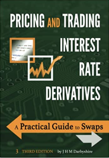
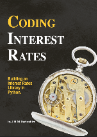

.. _about-doc:

******
About
******

The History and Context of Rateslib
************************************

*Rateslib* BETA was first released in April 2023.

The foundations of *rateslib* is really the code library
`Book IRDS3 <https://github.com/attack68/book_irds3>`_, which laid down
basic principles and was a sandbox code environment for the
publication *Pricing and Trading Interest Rate Derivatives: A Practical Guide to Swaps
(2022, 3rd Edition)*. Some of the code and algorithms also date back to the author's
time trading IRSs as a market-maker between 2006 and 2017.

The algorithms and mathematical work of *rateslib* is expected to be released in
early 2024 under the working title of *Coding Interest Rates: FX, Swaps and Bonds*

.. _pillars-doc:

Five Pillars of Rateslib's Design Philosophy
*********************************************

1) Maximise flexibility : Minimise user input
-----------------------------------------------------------------------

This is a user interface (UI) objective. *Rateslib* aims to
make technical and complex financial instrument analysis easily accessible and
consumable. This philosophy has shaped the the entire design and API architecture of *rateslib*.

For example, this library will not add esoteric or complex algorithms for valuing a
financial instrument. Although doing so satisfies the philosophy of maximising
flexibility, every addition adds documentation obfuscation, uncertainty
about market practice and likely extends parameter numbers. It breaks the
philosophy.

On the other hand this library will allow various *Curve* construction interpolation
algorithms because these are market standard and their parametrisation is simple and
well documented, and these have considerable impact on all users. It satisfies the
philosophy.

2) Prioritise sensitivities above valuation
-----------------------------------------------------

This is functionality objective. Risk sensitivities are harder to calculate than
valuation. To calculate risk it is
necessary to be able to calculate value. To calculate value it is not necessary
to calculate risk. Therefore making design choices around calculating risk avoids
the problem of building *Instruments* in a value sense and 'hacking' risk sensitivities
later.

This philosophy indirectly drives performant solutions. It is also the reason that
the library constructed and implemented its own automatic differentiation (AD)
toolset to properly label and be able to pass around derivatives from any object
or scenario to another. It also means that *npv*, *delta* and *gamma* have the
same arguments signature, which promotes usability.

3) Unify asset classes within a single UI
-------------------------------------------------------

This defines scope. *Rateslib* aims to unify interest rates, FX and inflation
in its first version.
The ambition is to incorporate volatility products into version two. Within
this unification we must include the commonly traded instruments within
each of these classes.

4) Achieve scalable performance
--------------------------------------------

This is a functionality objective.
Version one of *rateslib* is pure Python. The performance constraints this places are
restrictive. However, every method *rateslib* offers must be capable of producing
results in practical time. A fixed income library written in Python cannot achieve
what *rateslib* achieves without AD. Additionally many manual optimisations are
implemented and are documented.

A wider article about
`performance in rateslib <https://www.linkedin.com/pulse/rateslib-performance-1000-irs-rateslib>`_
is available following the link.

5) Transparency and validation is necessary
--------------------------------------------

This is a community objective.
No algorithm, optimisation or approximation is added without being documented
in **Coding Interest Rates**. The code coverage of the library strives to be 100%.
This API documentation should be exhaustive with demonstrative examples.
Where official sources (ISDA documentation, academic papers, issuer specifications)
are available their examples should be used as unit tests within *rateslib*.

A good
example for these are the UK DMO's Gilt calculations which are replicated exactly
by *rateslib*. Another example is the
`replication of Norges Bank NOWA calculator <https://www.linkedin.com/pulse/rateslib-vs-norges-bank-nowa-calculator-rateslib>`_

Releases
***********

A broad based release history is as follows:

v 0.3.0
--------
Release 29th Jul 2023

.. list-table::
   :widths: 25 75
   :header-rows: 1

   * - Feature
     - Description
   * - Legs
     - Added :class:`~rateslib.legs.IndexFixedLeg`,
       :class:`~rateslib.legs.ZeroIndexLeg`,
       and :class:`~rateslib.legs.IndexFixedLegExchange`.
   * - Instruments
     - Added :class:`~rateslib.instruments.IndexFixedRateBond`,
       :class:`~rateslib.instruments.IIRS`, :class:`~rateslib.instruments.ZCIS`.
   * - Curves
     - Added :class:`~rateslib.curves.CompositeCurve`.

v 0.2.0
--------
Release 15th May 2023

.. list-table::
   :widths: 25 75
   :header-rows: 1

   * - Feature
     - Description
   * - Instruments
     - Added :class:`~rateslib.instruments.BondFuture`.
   * - Curves
     - Added :class:`~rateslib.curves.IndexCurve`.

v 0.1.0
--------
Release 24th April 2023

.. list-table::
   :widths: 25 75
   :header-rows: 1

   * - Feature
     - Description
   * - Automatic Differentiation
     - A toolset for making risk sensitivity and gradient based calculations.
   * - Calendars
     - A toolset for handling dates and holiday calendars for schedules.
   * - Schedule
     - A toolset for generating financial schedules of financial instruments.
   * - Splines
     - A toolset for allowing spline interpolation.
   * - Curves
     - Initial classes for DF bases and value based interest rate curves.
   * - Periods
     - Initial classes for handling fixed periods, float periods and cashflows.
   * - Legs
     - Initial classes for aggregating periods.
   * - Instruments
     - Adding standard financial instruments such as securities: bonds and bills,
       and derivatives such as: IRS, SBS, FRA, XCS, FXSwap
   * - Solver
     - A set of algorithms for iteratively determining interest rate curves.
   * - FX
     - Initial classes for handling FX rates an Fx forwards.

Development Plan
*******************

As a new library the future development of *rateslib* is open to many avenues.
Some possibilities are listed below. The author is very interested in any feedback
and this can be given on the public **Issues** board at the project github
repository: `Rateslib Project <https://github.com/attack68/rateslib>`_, or by direct
email contact through **rateslib@gmail.com**.

.. list-table::
   :widths: 20 35 35 10
   :header-rows: 1

   * - Feature
     - Description
     - Consideration
     - Timeframe
   * - FX Spot and Repos
     - Adding basic funding instruments.
     - Likely (v1.0)
     - End 2023
   * - Coding Interest Rates
     - Officially document this library's algorithms and release the book.
     - Planned
     - End 2023
   * - Version 1.0
     - Release the official first non-beta version of this library.
     - Planned
     - End 2023
   * - Defaults
     - Adding the ability to define parameters by specification, e.g. "sofr irs" or
       "uk gilt", which set multiple default parameters.
     - Likely, to improve UI. (v1.0?)
     - By end 2023
   * - Vanilla FX options and volatility products
     - Adding option instruments and benchmark trades such as risk-reversals.
     - Highly likely (v2.0?)
     - By mid 2024
   * - Vanilla Swaptions
     - Adding the instruments priced by a volatility input.
     - Likely (v2.0 or v3.0?)
     - By end 2024
   * - SABR model for options
     - Adding the parameters to construct SABR vol surfaces/ cuves.
     - Possible, with dependencies to other developments. (v3.0?)
     - By end 2024
   * - Optimization of code
     - Using C extensions, or rust, or re-writing certain blocks to improve performance.
     - Likely to some degree, depending upon community adoption and contributions.
     - no ETA
   * - AD backend
     - Changing the AD implementation to another 3rd party (JAX, PyAudi)
     - Very unlikely, maturity of those libraries must increase and the performance
       improvements must be sufficient to warrant such a large codebase change.
     - no ETA
   * - JSON facility
     - Designing objects, as well as object oriented associations to be passed from
       server to client and vice versa to operate a cloud solution.
     - Possible, due to the author's interest in the topic, but not imminent.
     - no ETA
   * - Excel interaction
     - Allowing *rateslib* to be accessed via Excel in a structured way.
     - Possible, but not imminent, due to the unscoped problem.
     - no ETA
   * - Datafeeds
     - Allowing *rateslib* to access and consume data in a streaming environment
       working with other data providers APIs.
     - Unlikely, due to the subjectivity of every data consumer.
     - no ETA

About the Author
****************
TBD.

