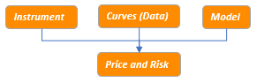

.. RatesLib documentation master file,
.. _guide-doc:

==========
User Guide
==========

Where to start?
===============

*Rateslib* tends to follow the typical quant architecture:

This means that **financial instrument specification**, **curve and/or surface construction**
from market data including **foreign exchange (FX)** will permit **pricing metrics** and **risk sensitivity**.
These functionalities are interlinked and potentially dependent upon each
other. This guide will introduce them in a structured way and give typical examples how they
are used in practice.

..
   .. note::

      If you see this icon |ico3| at any point after a section it will link to a section in the
      *rateslib-excel* documentation which may demonstrate the equivalent Python example in Excel.

Let's start with some fundamental *Curve* and *Instrument* constructors.

Trivial derivatives examples
----------------------------

*Rateslib* has two fundamental :ref:`Curve types<c-curves-doc>`. Most of the time you
will only need to use a :class:`~rateslib.curves.Curve`.

.. tabs::

   .. tab:: Curve

      A :class:`~rateslib.curves.Curve` is discount factor (DF) based and is constructed
      by providing DFs on specific node dates. Interpolation between ``nodes`` is
      configurable, but the below uses the *"log-linear"* default.

      .. ipython:: python

         from rateslib import *

         usd_curve = Curve(
             nodes={
                 dt(2022, 1, 1): 1.0,
                 dt(2022, 7, 1): 0.98,
                 dt(2023, 1, 1): 0.95
             },
             calendar="nyc",
             id="sofr",
             # convention="Act360"         # from defaults
             # interpolation="log_linear"  # from defaults
         )

   .. tab:: LineCurve

      A :class:`~rateslib.curves.LineCurve` is value based and is constructed
      by providing curve values on specific node dates. Interpolation between ``nodes`` is
      configurable, with the default being *"linear"* interpolation (hence *LineCurve*). This type
      has no DFs so can't be used for discounting cashflows.

      .. ipython:: python

         usd_legacy_3mIBOR = LineCurve(
             nodes={
                 dt(2022, 1, 1): 2.635,
                 dt(2022, 7, 1): 2.896,
                 dt(2023, 1, 1): 2.989,
             },
             calendar="nyc",
             id="us_ibor_3m",
             # convention="Act360"     # from defaults
             # interpolation="linear"  # from defaults
         )

   .. tab:: *(IndexCurve)*

      An *Index Curve* is required by certain products, e.g.
      inflation linked bonds (:class:`~rateslib.instruments.IndexFixedRateBond`) or
      zero coupon inflation swaps (:class:`~rateslib.instruments.ZCIS`). Adding ``index_base``
      and ``index_lag`` argument inputs extends a DF based :class:`~rateslib.curves.Curve` to
      work in these cases.

      .. ipython:: python

         usd_cpi = Curve(
             nodes={
                 dt(2022, 1, 1): 1.00,
                 dt(2022, 7, 1): 0.97,
                 dt(2023, 1, 1): 0.955,
             },
             index_base=308.95,
             index_lag=3,
             interpolation="linear_index",
             id="us_cpi",
         )

   .. tab:: *(Hazard Curve)*

      A *Hazard Curve* is used by credit *Instruments* when a default is possible. *Hazard Curves*
      utilise the same :class:`~rateslib.curves.Curve` class and the rates reflect overnight
      hazard rates and the DFs reflect survival probabilities.

      .. ipython:: python

         pfizer_hazard = Curve(
             nodes={
                 dt(2022, 1, 1): 1.0,
                 dt(2022, 7, 1): 0.998,
                 dt(2023, 1, 1): 0.995
             },
             id="pfizer_hazard",
             credit_recovery_rate=0.4,
             credit_discretization=23,
         )

Next, we will construct some basic derivative :ref:`Instruments<instruments-toc-doc>`.
These will use some market conventions defined by *rateslib* through its
:ref:`default argument specifications <defaults-arg-input>`, although all arguments can
be supplied manually if and when required.

.. tabs::

   .. group-tab:: IRS

      Here we create a short dated SOFR RFR interest rate swap (:class:`~rateslib.instruments.IRS`).

      .. ipython:: python

         irs = IRS(
             effective=dt(2022, 2, 15),
             termination="6m",
             notional=1000000000,
             fixed_rate=2.0,
             spec="usd_irs"
         )

   .. group-tab:: STIRFuture

      Here we create a SOFR STIR future (:class:`~rateslib.instruments.STIRFuture`).

      .. ipython:: python
         :suppress:

         from rateslib.instruments import STIRFuture

      .. ipython:: python

         stir = STIRFuture(
             effective=get_imm(code="H22"),
             termination=get_imm(code="M22"),
             contracts=100,
             price=97.495,
             spec="usd_stir",
         )

   .. group-tab:: FRA

      A US LIBOR :class:`~rateslib.instruments.FRA` is an obsolete *Instrument*, but we can still
      create one and these still trade in other currencies, e.g. EUR.

      .. ipython:: python

         fra = FRA(
             effective=dt(2022, 2, 16),
             termination="3m",
             frequency="Q",
             calendar="nyc",
             convention="act360",
             leg2_method_param=2,
             fixed_rate=2.5
         )

   .. group-tab:: CDS

      Here we construct a generic US investment grade credit default
      swap (:class:`~rateslib.instruments.CDS`)

      .. ipython:: python

         cds = CDS(
             effective=dt(2021, 12, 20),
             termination=dt(2022, 9, 20),
             notional=15e6,
             spec="us_ig_cds",
         )

   .. group-tab:: ZCIS

      This constructs a zero-coupon inflation swap
      (:class:`~rateslib.instruments.ZCIS`) with usual
      daily index interpolation and 3-month index lag.

      .. ipython:: python

         zcis = ZCIS(
             effective=dt(2022, 2, 2),
             termination="9m",
             notional=-25e6,
             fixed_rate=3.25,
             spec="usd_zcis",
         )

We can combine the *Curves* and the *Instruments* to give pricing metrics such as
:meth:`~rateslib.instruments.protocols._WithNPV.npv`,
:meth:`~rateslib.instruments.protocols._WithCashflows.cashflows`, and the mid-market
:meth:`~rateslib.instruments.protocols._WithRate.rate`, as well as others. Without further specification
these values are all expressed in the *Instrument's* local USD *settlement currency*.

.. tabs::

   .. group-tab:: IRS

      .. ipython:: python

         irs.npv(curves=usd_curve)

      .. ipython:: python

         irs.cashflows(curves=usd_curve)

   .. group-tab:: STIRFuture

      .. ipython:: python

         stir.npv(curves=usd_curve)

      .. ipython:: python

         stir.rate(curves=usd_curve, metric="price")

   .. group-tab:: FRA

      .. ipython:: python

         fra.npv(curves=[usd_legacy_3mIBOR, usd_curve])

      .. ipython:: python

         fra.rate(curves=[usd_legacy_3mIBOR, usd_curve])

   .. group-tab:: CDS

      .. ipython:: python

         cds.npv(curves=[pfizer_hazard, usd_curve])

      .. ipython:: python

         cds.rate(curves=[pfizer_hazard, usd_curve])

      .. ipython:: python

         cds.cashflows(curves=[pfizer_hazard, usd_curve])

   .. group-tab:: ZCIS

      .. ipython:: python

         zcis.npv(curves=[usd_cpi, usd_curve])

      .. ipython:: python

         zcis.rate(curves=[usd_cpi, usd_curve])

      .. ipython:: python

         zcis.cashflows(curves=[usd_cpi, usd_curve])

.. raw:: html

   

     
   

Securities and bonds
--------------------

*Rateslib* is steadily building a collection of market conventions for a host of global bonds.
Again these specifications are available at :ref:`default argument specifications <defaults-arg-input>`
for those that have already been populated.

.. tabs::

   .. tab:: Fixed Bonds

      A very common instrument in financial investing is a :class:`~rateslib.instruments.FixedRateBond`.
      At time of writing the on-the-run 10Y US treasury was the 3.875% Aug 2033 bond. Here we
      construct this using the street convention and derive the price from yield-to-maturity and
      risk calculations.

      .. ipython:: python

         fxb = FixedRateBond(
             effective=dt(2023, 8, 15),
             termination=dt(2033, 8, 15),
             fixed_rate=3.875,
             spec="us_gb"  # US Government Bond
         )
         fxb.accrued(settlement=dt(2025, 2, 14))
         fxb.price(ytm=4.0, settlement=dt(2025, 2, 14))
         fxb.duration(ytm=4.0, settlement=dt(2025, 2, 14), metric="duration")
         fxb.duration(ytm=4.0, settlement=dt(2025, 2, 14), metric="modified")
         fxb.duration(ytm=4.0, settlement=dt(2025, 2, 14), metric="risk")

   .. tab:: FRN

      A :class:`~rateslib.instruments.FloatRateNote` can also be constructed. The below bond
      settles to 3M-TermSOFR which is an *IBOR* style term ``fixing_method`` (and we simulate
      its pricing with the *Curves* already constructed). Compounded *RFR*
      FRNs can also be constructed, using other method inputs.

      .. ipython:: python

         frn = FloatRateNote(
             effective=dt(2021, 8, 15),
             termination=dt(2022, 8, 15),
             frequency="Q",
             float_spread=86.0,
             spread_compound_method="none_simple",
             convention="act360",
             calendar="nyc",
             payment_lag=0,
             fixing_method="ibor",
             method_param=0,  # fixing lag is 0 business days
             rate_fixings=[2.00, 2.14],
             ex_div=1,
             settle=1,
             currency="usd",
         )
         frn.accrued(settlement=dt(2022, 1, 2))
         frn.rate(curves=[usd_legacy_3mIBOR, usd_curve])
         frn.cashflows(curves=[usd_legacy_3mIBOR, usd_curve])

   .. tab:: Bill

      Below we construct a US government bond :class:`~rateslib.instruments.Bill` using
      default ``spec``.

      .. ipython:: python

         bill = Bill(
             effective=dt(2024, 10, 24),
             termination=dt(2025, 4, 24),
             spec="us_gbb",  # US Government Bond-Bill
         )
         bill.discount_rate(price=99.0808021, settlement=dt(2025, 2, 4))
         bill.ytm(price=99.0808021, settlement=dt(2025, 2, 4))
         bill.duration(ytm=4.18875, settlement=dt(2025, 2, 4), metric="risk")
         bill.price(rate=4.18875, settlement=dt(2025, 2, 4))

   .. tab:: Inflation linked

      Below we construct an :class:`~rateslib.instruments.IndexFixedRateBond`, using relevant
      indexing arguments.

      .. ipython:: python

         ifrb = IndexFixedRateBond(  # CUSIP:91282CCA7 ISIN:US91282CCA71
             effective=dt(2021, 4, 15),
             termination=dt(2026, 4, 15),
             fixed_rate=0.125,
             index_base=262.250270,
             index_fixings=265.0,
             spec="us_gbi",
         )
         ifrb.price(ytm=1.397926, settlement=dt(2025, 2, 4))
         ifrb.accrued(settlement=dt(2025, 2, 4))
         ifrb.cashflows(curves=[usd_cpi, usd_curve])

.. raw:: html

   

.. raw:: html

   

     
   

.. toctree::
    :hidden:
    :maxdepth: 0
    :titlesonly:

    g_instruments.rst

There are some interesting :ref:`Cookbook <cookbook-doc>` articles
on :class:`~rateslib.instruments.BondFuture` and cheapest-to-deliver (CTD) analysis.

Quick look at FX
==================

Spot rates and conversion
-------------------------

The above values were all calculated and displayed in USD. That is the default
currency in *rateslib* and the local currency of those *Instruments*. We can convert these values
into another currency using the :class:`~rateslib.fx.FXRates` class. This is a basic class which is
parametrised by some exchange rates.

.. tabs::

   .. tab:: FXRates

      .. ipython:: python

         fxr = FXRates({"eurusd": 1.05, "gbpusd": 1.25})
         fxr.rates_table()

We now have a mechanism by which to specify values in other currencies.

.. tabs::

   .. group-tab:: IRS

      .. ipython:: python

         irs.npv(curves=usd_curve, fx=fxr, base="usd")
         irs.npv(curves=usd_curve, fx=fxr, base="eur")

   .. group-tab:: STIRFuture

      .. ipython:: python

         stir.npv(curves=usd_curve, fx=fxr, base="usd")
         stir.npv(curves=usd_curve, fx=fxr, base="eur")

   .. group-tab:: FRA

      .. ipython:: python

         fra.npv(curves=[usd_legacy_3mIBOR, usd_curve], fx=fxr, base="usd")
         fra.npv(curves=[usd_legacy_3mIBOR, usd_curve], fx=fxr, base="eur")

   .. group-tab:: CDS

      .. ipython:: python

         cds.npv(curves=[pfizer_hazard, usd_curve], fx=fxr, base="usd")
         cds.npv(curves=[pfizer_hazard, usd_curve], fx=fxr, base="eur")

   .. group-tab:: ZCIS

      .. ipython:: python

         zcis.npv(curves=[usd_cpi, usd_curve], fx=fxr, base="usd")
         zcis.npv(curves=[usd_cpi, usd_curve], fx=fxr, base="eur")

.. raw:: html

   

     
   

One observes that the value returned here is not a float but a :class:`~rateslib.dual.Dual`
which is part of *rateslib's* AD framework. This is the first example of capturing a
sensitivity, which here denotes the sensitivity of the EUR NPV relative to the EURUSD FX rate.
One can read more about this particular treatment of FX
:ref:`here<fx-dual-doc>` and more generally about the dual AD framework :ref:`here<dual-doc>`.

FX forwards
------------

For multi-currency derivatives we need more than basic, spot exchange rates.
We need an :class:`~rateslib.fx.FXForwards` market.
This stores the FX rates and the interest
rates curves that are used for all the FX-interest rate parity derivations. With these
we can calculate forward FX rates and also ad-hoc FX swap rates.

When defining the ``fx_curves`` dict mapping, the key *"eurusd"* should be interpreted as; **the
Curve for EUR cashflows, collateralised in USD**, and similarly for other entries.

.. tabs::

   .. tab:: FXForwards

      .. ipython:: python

         eur_curve = Curve({
             dt(2022, 1, 1): 1.0,
             dt(2022, 7, 1): 0.972,
             dt(2023, 1, 1): 0.98},
             calendar="tgt",
         )
         eurusd_curve = Curve({
             dt(2022, 1, 1): 1.0,
             dt(2022, 7, 1): 0.973,
             dt(2023, 1, 1): 0.981}
         )
         fxf = FXForwards(
             fx_rates=FXRates({"eurusd": 1.05}, settlement=dt(2022, 1, 1)),
             fx_curves={
                 "usdusd": usd_curve,
                 "eureur": eur_curve,
                 "eurusd": eurusd_curve,
             }
         )
         fxf.rate("eurusd", settlement=dt(2023, 1, 1))
         fxf.swap("eurusd", settlements=[dt(2022, 2, 1), dt(2022, 5, 2)])

.. raw:: html

   

     
   

*FXForwards* objects are comprehensive and more information regarding all of the
:ref:`FX features<fx-doc>` is available in this link.

.. toctree::
    :hidden:
    :maxdepth: 0
    :titlesonly:

    u_defaults.rst
    u_fixings.rst
    g_fx.rst

More about instruments
======================

We've seen some *single currency derivatives* above.
A complete guide for all of the :ref:`Instruments<instruments-toc-doc>` is available in
this link. That will also introduce the building blocks; :ref:`Legs<legs-doc>` and :ref:`Periods<periods-doc>`.

Multi-currency instruments
--------------------------

Let's take a look at the multi-currency instruments. Notice how these *Instruments*
maintain consistent method naming conventions with those above. This makes it possible to plug
any *Instruments* into a :class:`~rateslib.solver.Solver` to calibrate *Curves*
around target mid-market rates, and generate market risks.

.. tabs::

   .. tab:: FXSwap

      This is an :class:`~rateslib.instruments.FXSwap`.

      .. ipython:: python

         fxs = FXSwap(
             effective=dt(2022, 2, 1),
             termination="3m",  # May-1 is a holiday, May-2 is business end date.
             pair="eurusd",
             notional=20e6,
             calendar="tgt|fed",
         )
         fxs.rate(curves=[eurusd_curve, usd_curve], fx=fxf)
         fxs.cashflows_table(curves=[eurusd_curve, usd_curve], fx=fxf)

   .. tab:: FXExchange

      An :class:`~rateslib.instruments.FXForward` is a forward FX transaction.

      .. ipython:: python

         fxe = FXForward(
             settlement=dt(2022, 4, 1),
             pair="eurusd",
             notional=10e6,
             fx_rate=1.035,
         )
         fxe.rate(curves=[eurusd_curve, usd_curve], fx=fxf)
         fxe.npv(curves=[eurusd_curve, usd_curve], fx=fxf)
         fxe.cashflows_table(curves=[eurusd_curve, usd_curve], fx=fxf)

   .. tab:: XCS

      Cross-currency swaps (:class:`~rateslib.instruments.XCS`) are easily configured and
      analysed in *rateslib*.

      .. ipython:: python

         xcs = XCS(
             effective=dt(2022, 4, 1),
             termination="6m",
             spec="eurusd_xcs",
             float_spread=-3.0,
             notional=25e6,
         )
         xcs.rate(curves=[eur_curve, eurusd_curve, usd_curve, usd_curve], fx=fxf)
         xcs.cashflows(curves=[eur_curve, eurusd_curve, usd_curve, usd_curve], fx=fxf)
         xcs.cashflows_table(curves=[eur_curve, eurusd_curve, usd_curve, usd_curve], fx=fxf)

   .. tab:: NDF

      Non-deliverable forwards (:class:`~rateslib.instruments.NDF`) can be constructed.

      .. ipython:: python

         ndf = NDF(
             settlement=dt(2022, 8, 15),
             pair="eurusd",
             notional=10e6,  # 10mm EUR
             calendar="tgt|fed",
             fx_rate=1.1
         )
         ndf.rate(fx=fxf)
         ndf.cashflows(curves=usd_curve, fx=fxf)
         ndf.cashflows_table(curves=usd_curve, fx=fxf)

   .. tab:: NDIRS

      A Non-deliverable IRS (:class:`~rateslib.instruments.IRS`) can be constructed.

      .. ipython:: python

         ndirs = IRS(
             currency="usd",   #  <- local settlement currency
             pair="eurusd",    #  <- EUR is the reference and notional currency
             effective=dt(2022, 2, 1),
             termination="2M",
             frequency="M",
             notional=10e6,    # 10mm EUR
             calendar="tgt|fed",
         )
         ndirs.rate(curves=[eur_curve, usd_curve], fx=fxf)
         ndirs.cashflows(curves=[eur_curve, usd_curve], fx=fxf)
         ndirs.cashflows_table(curves=[eur_curve, usd_curve], fx=fxf)

   .. tab:: NDXCS

      A Non-deliverable XCS (:class:`~rateslib.instruments.NDXCS`) can be constructed.

      .. ipython:: python

         ndxcs = NDXCS(
             effective=dt(2022, 2, 1),
             termination="2M",
             currency="usd",      #  <- local settlement currency
             pair="eurusd",       #  <- EUR is the reference and notional currency
             frequency="M",
             notional=10e6,       #  <- 10mm EUR set on Leg1
             calendar="tgt|fed",
             leg2_fx_fixings=1.2  #  <- 12mm USD effectively set on Leg2
         )
         ndxcs.rate(curves=[eur_curve, usd_curve, usd_curve, usd_curve], fx=fxf)
         ndxcs.cashflows(curves=[eur_curve, usd_curve, usd_curve, usd_curve], fx=fxf)
         ndxcs.cashflows_table(curves=[eur_curve, usd_curve, usd_curve, usd_curve], fx=fxf)

.. raw:: html

   

     
   

Calibrating curves with a solver
=================================

The guide for :ref:`Constructing Curves<curves-doc>` introduces the main
curve classes, :class:`~rateslib.curves.Curve` and :class:`~rateslib.curves.LineCurve`.
It also touches on some of the more
advanced curves :class:`~rateslib.curves.CompositeCurve`,
:class:`~rateslib.curves.ProxyCurve`, and :class:`~rateslib.curves.MultiCsaCurve`.

.. toctree::
    :hidden:
    :maxdepth: 0
    :titlesonly:

    g_curves.rst

Calibrating curves is a very natural thing to do in fixed income. We typically use
market prices of commonly traded instruments to set values.
*Smiles* and *Surfaces* are also calibrated using the same optimising algorithms.

Below we demonstrate how to calibrate the :class:`~rateslib.curves.Curve` that
we created above in the initial trivial example using SOFR swap market data.
In this case we invoke the :class:`~rateslib.solver.Solver` which forces mutations to the
provided ``curves`` making sure they reprice the provided calibrating ``instruments`` at the
gives rates ``s``.
In this case we target the *6M* and *1Y* *IRS* rates.

.. ipython:: python

   solver = Solver(
       curves=[usd_curve],
       instruments=[
           IRS(dt(2022, 1, 1), "6M", spec="usd_irs", curves="sofr"),
           IRS(dt(2022, 1, 1), "1Y", spec="usd_irs", curves="sofr"),
       ],
       s=[4.35, 4.85],
       instrument_labels=["6M", "1Y"],
       id="us_rates"
   )

.. raw:: html

   

     
   

Solving was a success! Observe that the DFs on the *Curve* have been updated:

.. ipython:: python

   usd_curve.nodes

We can plot the overnight rates for the calibrated curve. This curve uses *'log_linear'*
interpolation so the overnight forward rates are constant between node dates.

.. ipython:: python

   usd_curve.plot("1b", labels=["SOFR o/n"])

.. plot::

   from rateslib import *
   import matplotlib.pyplot as plt
   from datetime import datetime as dt
   import numpy as np
   usd_curve = Curve(
       nodes={
           dt(2022, 1, 1): 1.0,
           dt(2022, 7, 1): 0.98,
           dt(2023, 1, 1): 0.95
       },
       calendar="nyc",
       id="sofr",
   )
   usd_args = dict(
       effective=dt(2022, 1, 1),
       spec="usd_irs",
       curves="sofr"
   )
   solver = Solver(
       curves=[usd_curve],
       instruments=[
           IRS(**usd_args, termination="6M"),
           IRS(**usd_args, termination="1Y"),
       ],
       s=[4.35, 4.85],
       instrument_labels=["6M", "1Y"],
       id="us_rates"
   )
   fig, ax, line = usd_curve.plot("1b", labels=["SOFR o/n"])
   plt.show()

Risk Sensitivities
===================

*Rateslib's* can calculate **delta** and **cross-gamma** risks relative to the calibrating
*Instruments* of a *Solver*. Rateslib also unifies these risks against the **FX rates**
used to create an *FXForwards* market, to provide a fully consistent risk framework
expressed in arbitrary currencies. See the
:ref:`risk framework<risk-toc-doc>` notes.

Performance wise, because *rateslib* uses dual number AD upto 2nd order, combined with the
appropriate analysis, it is shown to calculate a 150x150 *Instrument* cross-gamma grid
(22,500 elements) from a calculated portfolio NPV in approximately 250ms.

.. toctree::
    :hidden:
    :maxdepth: 0
    :titlesonly:

    g_risk.rst

Scheduling
===========

Necessary functionality is provided natively by *rateslib*. See:

- :ref:`Holiday calendar types<cal-doc>`
- :ref:`Schedule building<schedule-doc>`
- :ref:`Day count fractions (DCFs)<dcf-doc>`

.. toctree::
    :hidden:
    :maxdepth: 0
    :titlesonly:

    g_scheduling.rst

Utilities
==========

*Rateslib* could not function without some utility libraries. These are often
referenced in other guides as they arise and can also be linked to from those
sections.

Specifically those utilities are:

- :ref:`Piecewise polynomial splines for curve interpolation<splines-doc>`
- :ref:`Forward mode automatic differentiation (AD) and Dual numbers<dual-doc>`
- :ref:`Defaults used for instrument specification<defaults-doc>`

.. toctree::
    :hidden:
    :maxdepth: 0
    :titlesonly:

    g_utilities.rst

Cookbook
=========

This is a collection of more detailed examples and explanations that don't necessarily fall
into any one category. See the :ref:`Cookbook index <cookbook-doc>`.

.. toctree::
    :hidden:
    :maxdepth: 0
    :titlesonly:

    g_cookbook.rst

Advanced Concepts
==================

These sections describe and exemplify some of the architectural choices in *rateslib*.

.. toctree::
    :hidden:
    :maxdepth: 0
    :titlesonly:

    g_advancedconcepts.rst

Pricing Mechanisms
------------------

Since *rateslib* is an object oriented library with object associations we give
detailed instructions of the way in which the associations can be constructed in
:ref:`mechanisms<mechanisms-doc>`.

The **key takeway** is that when you initialise and create an *Instrument* you can do one
of three things:

1) Not provide any *Curves* (or *Vol* surface) for pricing upfront (``curves=NoInput(0)``).
2) Create an explicit association to pre-existing Python objects, e.g. ``curves=my_curve``.
3) Define some reference to a *Curves* mapping with strings using ``curves="my_curve_id"``.

If you do *1)* then you must provide *Curves* at price
time: ``instrument.npv(curves=my_curve)``.

If you do *2)* then you do not need to provide anything further at price time:
``instrument.npv()``. But you still can provide *Curves* directly, like for *1)*, as an override.

If you do *3)* then you can provide a :class:`~rateslib.solver.Solver` which contains the *Curves* and will
resolve the string mapping: ``instrument.npv(solver=my_solver)``. But you can also provide *Curves*
directly, like for *1)*, as an override.

**Best practice** in *rateslib* is to use *3)*. This is the safest and most flexible approach and
designed to work best with risk sensitivity calculations also.

Mutability
----------

A proper outline of the mutability of objects is given in :ref:`mutability<mutability-doc>`.

In summary, **best practice** is to create new instances and avoid directly overwriting or adding
to class attributes. *Don't mutate a created object unless using an official method to do so*,
e.g. :meth:`FXRates.update<rateslib.fx.FXRates.update>` or
:meth:`Curve.update<rateslib.curves.Curve.update>`

.. toctree::
    :hidden:

    g_coverage.rst
