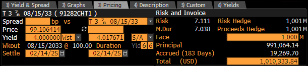

.. RatesLib documentation master file.

.. raw:: html

   

       
   

   

      
      
      
      
      
      
      
   

   
   

   <a class="github-button" href="https://github.com/attack68/rateslib" data-icon="octicon-star" data-size="large" data-show-count="true" aria-label="Star attack68/rateslib on GitHub">Star</a>
   <a class="github-button" href="https://github.com/attack68/rateslib/issues" data-icon="octicon-issue-opened" data-size="large" data-show-count="true" aria-label="Issue attack68/rateslib on GitHub">Issue</a>
   

``Rateslib`` is a state-of-the-art **fixed income library** designed for Python.
Its purpose is to provide advanced, flexible and efficient fixed income analysis
with a high level, well documented API.

.. raw:: html

   <table style="width:100%; text-align:center; border-collapse: separate; font-size:0.8em; border: 1px solid #d0d7de; border-radius: 5pt;">
      <thead style="background-color: #ebf0f4;">
        <tr>
          <th style="color:#459db9; border-bottom: 1px solid #d0d7de;">Academic, Personal, or Educational Use</th>
          <th style="color:#459db9; border-bottom: 1px solid #d0d7de;">Commercial Use: Banks, Funds, Accountants, Treasuries</th>
        </tr>
      </thead>
      <tbody>
        <tr>
          <td style="color:green; font-size: 1.25em; font-weight:bold;">FREE to use and modify. </td>
          <td style="">
          Not Licenced. 
             
             Can purchase a licence extension. $300 per year / per user. 
             
             contact: rateslib@gmail.com
             
          </td>
        </tr>
      </tbody>
   </table>

The techniques and object interaction within *rateslib* were inspired by
the requirements of multi-disciplined fixed income teams working, both cooperatively
and independently, within global investment banks.

Highlights
==========

*Curve construction is simple but has huge flexibility*
--------------------------------------------------------

Multiple interpolation modes are offered by default and the generalised process for curve
solving means very specific pricing artefacts can be accurately modelled with the
correct formulations. The framework is accessible and requires minimal configuration.

.. container:: twocol

   .. container:: leftside40

      .. code-block:: python

         usd_curve = Curve(
             nodes={...},
             convention="act360",
             calendar="nyc",
             interpolation="log_linear",
             id="sofr",
         )
         solver = Solver(
             curves=[usd_curve],
             instruments=[...],
             weights=[...],
             s=[...],
         )

   .. container:: rightside60

      .. image:: _static/index_sofr.png
         :alt: Curve construction is flexible
         :width: 351

.. raw:: html

   

*API is designed for users with full documentation*
-----------------------------------------------------------------

Although any fixed income library uses complex mathematical processes, the API has been
carefully designed to provide a workflow that is very intuitive. In the case of using it
for small scale learning items often few parameters and arguments are required.
For larger series of curves and more complicated object oriented
associations the API signature does not materially change. Best practice is demonstrated in
documentation examples.

.. code-block:: python

   xcs = XCS(
       effective=dt(2022, 2, 14), termination="15M",
       notional=100e6, float_spread=-10.25,
       spec="eurusd_xcs", curves=[...],
   )  # Create a EUR/USD Cross-Ccy Swap

   xcs.rate(solver=solver)
   <Dual: -14.294203, [...], [...]>

   xcs.npv(solver=solver, base="eur")
   <Dual: -50,073.295467, [...], [...]>

*Wide range of fixed income Instruments available*
----------------------------------------------------

The most recent version of *rateslib* contains the main *Instruments* that
dominate linear fixed income products. The large array of input parameters for these gives scope
to fully capture the nuances of these products across sectors and geographic regions,
capturing aspects like trading calendars, day count conventions, payment delays, etc. New
specifications and calendars are continually being added as users enquire.

A good example is a **US Treasury Bond**, replicated here with *rateslib* and the equivalent
ticket in Bloomberg for reference point.

.. ipython:: python

   ust = FixedRateBond(
       effective=dt(2023, 8, 15), termination=dt(2033, 8, 15),
       fixed_rate=3.875, spec="ust"
   )  # Create a US-Treasury bond
   ust.price(ytm=4.0, settlement=dt(2025, 2, 14))
   ust.duration(ytm=4.0, settlement=dt(2025, 2, 14), metric="risk")

*Minimal dependencies to other Python libraries*
--------------------------------------------------

The dependencies are to **NumPy**, **Pandas**, and **Matplotlib**. *Rateslib* does
not have any dependencies to any automatic
differentiation libraries, such as PyAudi or JAX, preferring initially to use its
own forward mode module.

The test coverage is very high.

Licence
=======

This library is released under a **Creative Commons Attribution, Non-Commercial,
No-Derivatives 4.0 International Licence**. See :ref:`here<licence-doc>` for more details.

Get Started
===========

Move on to the next page to :ref:`Get Started<pricing-doc>`

.. toctree::
    :maxdepth: 0
    :titlesonly:
    :hidden:

    i_get_started.rst
    i_licence.rst
    i_guide.rst
    i_about.rst
    i_api.rst
    i_whatsnew.rst

