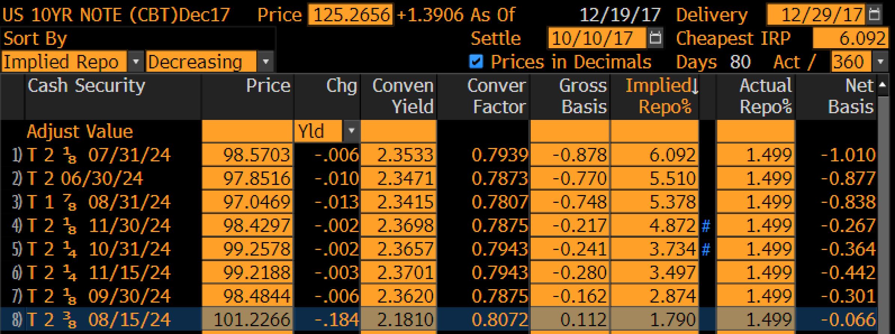

.. _bondbasis-doc:

.. ipython:: python
   :suppress:

   from rateslib.curves import *
   from rateslib.instruments import *
   import matplotlib.pyplot as plt
   from datetime import datetime as dt
   import numpy as np
   from pandas import DataFrame, option_context

Exploring Bond Basis and Bond Futures DV01
********************************************

The first task for example purposes is to create a US-Treasury *Instrument*, that
will serve as the CTD bond, and a CME 10Y Note Future.

.. ipython:: python

   ust = FixedRateBond(
       effective=dt(2017, 8, 15),
       termination=dt(2024, 8, 15),
       fixed_rate=2.375,
       notional=-1e6,
       spec="ust",
       curves="bcurve",
   )
   usbf = BondFuture(
       coupon=6.0,
       delivery=(dt(2017, 12, 1), dt(2017, 12, 29)),
       basket=[ust],
       calc_mode="ust_long",
       nominal=100e3,
       contracts=10,
   )

Without constructing any *Curves* we can analyse this bond future with static data,

.. ipython:: python

   df = usbf.dlv(
       future_price=125.2656,
       prices=[101.2266],
       repo_rate=1.499,
       settlement=dt(2017, 10, 10),
       delivery=dt(2017, 12, 29),
       convention="act360",
   )
   with option_context("display.float_format", lambda x: '%.6f' % x):
       print(df)

A comparison with Bloomberg is shown below,

Building a curve to reprice the *Instruments*
----------------------------------------------

The above calculations are performed with analogue bond formulae. We can build
and *Solve* a *Curve*.

.. ipython:: python

   bcurve = Curve(
       nodes={dt(2017, 10, 9): 1.0, dt(2024, 8, 17): 1.0},
       calendar="nyc",
       convention="act360",
       id="bcurve"
   )
   solver = Solver(
       curves=[bcurve],
       instruments=[(ust, (), {"metric": "ytm"})],
       s=[2.18098],
       instrument_labels=["bond ytm"],
       id="bonds",
   )

The following is a comparison between analogue methods without a *Curve* and
digital methods that use this numerical *Curve* and discounted cashflows, to measure
the **risk sensitivity** of the bond.

.. container:: twocol

   .. container:: leftside

      **Duration** and **Convexity**

      .. ipython:: python

         ust.duration(
             ytm=2.18098,
             settlement=dt(2017, 10, 10),
             metric="risk"
         ) * -100
         ust.convexity(
             ytm=2.18098,
             settlement=dt(2017, 10, 10)
         )

   .. container:: rightside

      **Delta** and **Gamma**

      .. ipython:: python

        delta = ust.delta(solver=solver)
        with option_context("display.float_format", lambda x: '%.6f' % x):
            print(delta)

        gamma = ust.gamma(solver=solver)
        with option_context("display.float_format", lambda x: '%.6f' % x):
            print(gamma)

Metrics for futures
---------------------

We can use the same principle to measure the bond future.

The following is a comparison between analogue methods without a *Curve* and
digital methods that use a numerical *Curve* and discounted cashflows, to measure
the **risk sensitivity** of the bond.

.. container:: twocol

   .. container:: leftside

      **Duration** and **Convexity**

      .. ipython:: python

         usbf.duration(
             future_price=125.2656,
             delivery=dt(2017, 12, 29),
             metric="risk"
         ) * 100
         usbf.convexity(
             future_price=125.2656,
             delivery=dt(2017, 12, 29),
         )

   .. container:: rightside

      **Delta** and **Gamma**

      .. ipython:: python

        delta = usbf.delta(solver=solver)
        with option_context("display.float_format", lambda x: '%.6f' % x):
            print(delta)

        gamma = usbf.gamma(solver=solver)
        with option_context("display.float_format", lambda x: '%.6f' % x):
            print(gamma)

The above *Curve* and *Solver* is not completely useful for a bond futures.
An important part of its pricing is the repo rate, so we extend the *Curve*
and *Solver* to have this relevant pricing component.

.. ipython:: python

   bcurve = Curve(
       nodes={
           dt(2017, 10, 9): 1.0,
           dt(2017, 12, 29): 1.0,
           dt(2024, 8, 17): 1.0,
       },
       calendar="nyc",
       convention="act360",
       id="bcurve",
   )
   solver = Solver(
       curves=[bcurve],
       instruments=[
           IRS(dt(2017, 10, 9), dt(2017, 12, 29), spec="usd_irs", curves="bcurve"),
           (ust, (), {"metric": "ytm"})
       ],
       s=[1.790, 2.18098],
       instrument_labels=["repo", "bond ytm"],
       id="bonds",
   )