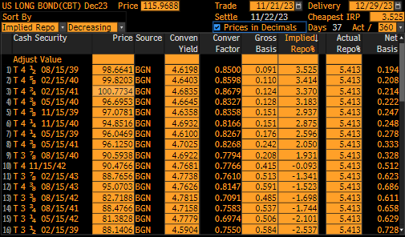
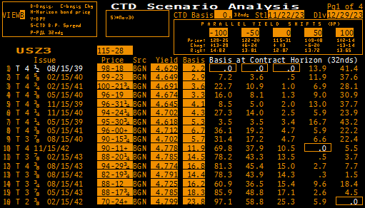

.. _bondctd-doc:

.. ipython:: python
   :suppress:

   from rateslib.curves import *
   from rateslib.instruments import *
   import matplotlib.pyplot as plt
   from datetime import datetime as dt
   import numpy as np
   from pandas import DataFrame, option_context

Bond Future CTD Multi-Scenario Analysis
********************************************

In late 2023 CTD analysis of the US 30Y Treasury Bond Future was worth exploring because
quickly rising yields led to multiple changes in the CTD bond.

This page will demonstrate how one might use *rateslib* to perform some of this analysis.

First we need to configure all of the *Instruments* and their prices. This is shown statically below (and actually
there were many more bonds available in this basket, but this group proved to be the most relevant).

.. ipython:: python

   data = DataFrame(
       data= [
           [FixedRateBond(dt(2022, 1, 1), dt(2039, 8, 15), fixed_rate=4.5, spec="ust", curves="bcurve"), 98.6641],
           [FixedRateBond(dt(2022, 1, 1), dt(2040, 2, 15), fixed_rate=4.625, spec="ust", curves="bcurve"), 99.8203],
           [FixedRateBond(dt(2022, 1, 1), dt(2041, 2, 15), fixed_rate=4.75, spec="ust", curves="bcurve"), 100.7734],
           [FixedRateBond(dt(2022, 1, 1), dt(2040, 5, 15), fixed_rate=4.375, spec="ust", curves="bcurve"), 96.6953],
           [FixedRateBond(dt(2022, 1, 1), dt(2039, 11, 15), fixed_rate=4.375, spec="ust", curves="bcurve"), 97.0781],
           [FixedRateBond(dt(2022, 1, 1), dt(2040, 11, 15), fixed_rate=4.25, spec="ust", curves="bcurve"), 94.8516],
           [FixedRateBond(dt(2022, 1, 1), dt(2039, 5, 15), fixed_rate=4.25, spec="ust", curves="bcurve"), 96.0469],
           [FixedRateBond(dt(2022, 1, 1), dt(2041, 5, 15), fixed_rate=4.375, spec="ust", curves="bcurve"), 96.1250],
           [FixedRateBond(dt(2022, 1, 1), dt(2040, 8, 15), fixed_rate=3.875, spec="ust", curves="bcurve"), 90.5938],
           [FixedRateBond(dt(2022, 1, 1), dt(2042, 11, 15), fixed_rate=4.00, spec="ust", curves="bcurve"), 90.4766],
           [FixedRateBond(dt(2022, 1, 1), dt(2043, 2, 15), fixed_rate=3.875, spec="ust", curves="bcurve"), 88.7656],
           [FixedRateBond(dt(2022, 1, 1), dt(2043, 8, 15), fixed_rate=4.375, spec="ust", curves="bcurve"),  95.0703],
           [FixedRateBond(dt(2022, 1, 1), dt(2042, 8, 15), fixed_rate=3.375, spec="ust", curves="bcurve"), 82.7188],
           [FixedRateBond(dt(2022, 1, 1), dt(2041, 8, 15), fixed_rate=3.75, spec="ust", curves="bcurve"), 88.4766],
           [FixedRateBond(dt(2022, 1, 1), dt(2042, 5, 15), fixed_rate=3.25, spec="ust", curves="bcurve"), 81.3828],
           [FixedRateBond(dt(2022, 1, 1), dt(2039, 2, 15), fixed_rate=3.50, spec="ust", curves="bcurve"), 88.1406],
       ],
       columns=["bonds", "prices"],
   )
   usz3 = BondFuture(  # Construct the BondFuture Instrument
       coupon=6.0,
       delivery=(dt(2023, 12, 1), dt(2023, 12, 29)),
       basket=data["bonds"],
       nominal=100e3,
       calendar="nyc",
       currency="usd",
       calc_mode="ust_long",
   )
   dlv = usz3.dlv(  # Analyse the deliverables as of the current prices
       future_price=115.9688,
       prices=data["prices"],
       settlement=dt(2023, 11, 22),
       repo_rate=5.413,
       convention="act360",
   )
   with option_context("display.float_format", lambda x: '%.6f' % x):
       print(dlv)

Compared with the Bloomberg read out for the same data:

Analysing the CTD on Parallel Yield Changes
---------------------------------------------

In order to analyse what happens to bond prices under a parallel shift of the yield curve it is
more accurate to calculate a discount factor :class:`~rateslib.curves.Curve` and use the
:meth:`~rateslib.curves.Curve.shift` method to ensure this is consistently applied to every *Bond*.

This *Curve* has a node date placed at the maturity of every bond so that we will be able to
reprice every *Bond* price exactly when using a :class:`~rateslib.solver.Solver`.

.. ipython:: python

   unsorted_nodes = {
       dt(2023, 11, 21): 1.0, #  Today's date
       **{_.leg1.schedule.termination: 1.0 for _ in data["bonds"]}
   }
   bcurve = Curve(
       nodes=dict(sorted(unsorted_nodes.items(), key=lambda _: _[0])),
       id="bcurve",
   )
   solver = Solver(
       curves=[bcurve],
       instruments=data["bonds"],
       s=data["prices"],
   )

It is now possible to calculate any bond price under a shifted curve. Consider,

.. ipython:: python

   data["bonds"][0].rate(curves=bcurve.shift(10))  # price of 4.5% Aug '39 with +10bps in rates.

.. note::

   Once a *Solver* has been used the *Curve* contains 1st order AD information (usually for risk
   sensitivity calculations). For the processes
   we will be performing below this is not necessary and it makes for faster calculations to turn
   it off.

   .. ipython:: python

      bcurve._set_ad_order(order=0)
      data["bonds"][0].rate(curves=bcurve.shift(10))

Calculating the DV01 of the BondFuture
----------------------------------------

The *'risk'* DV01 of the *BondFuture* is calculated by:

i) implying the *invoice price* of each *Bond* in the basket from the *BondFuture* price,
ii) determining each of those *Bonds* *'risk'* duration for *settlement* at
    *delivery*, with that *invoice price*, and then dividing by the *conversion factor*,
iii) selecting the result that coincides with the CTD.

We will aim to plot a graph of *BondFuture* DV01s versus parallel shifts in the curve. Since the
*Bonds* are, in some cases, very similar from a CTD perspective we will plot the CTD bond, and
the second and third CTD bonds.

.. ipython:: python

   x, y1, y2, y3 = [], [], [], []  # containers for graph data
   for shift in range(-50, 105, 5):
       scurve = bcurve.shift(shift)                   # Shift the curve by a number of bps
       future_price = usz3.rate(curves=scurve)        # Find the future's price from the curve
       ctd_indexes = usz3.ctd_index(                  # Determine the CTDs with new prices
           future_price=future_price,
           prices=[_.rate(curves=scurve) for _ in data["bonds"]],
           settlement=dt(2023, 11, 22),
           ordered=True,
       )
       risks = usz3.duration(future_price)            # Find the Future DV01 from each Bond in basket
       y1.append(risks[ctd_indexes[0]])
       y2.append(risks[ctd_indexes[1]])
       y3.append(risks[ctd_indexes[2]])
       x.append(shift)                                # Fill graph containers with data

With all the data calculated we can plot the graph.

.. ipython:: python
   :savefig:OUTFILE

   fig, axs = plt.subplots(1,1);
   axs.plot(x, y1, 'o', markersize=8.0, label="1st CTD");
   axs.plot(x, y2, 'o', markersize=4.0, label="2nd CTD");
   axs.plot(x, y3, 'o', markersize=2.0, label="3rd CTD");
   axs.legend();
   axs.set_xlabel("Parallel shift (bps)");
   axs.set_ylabel("Future DV01");

.. plot::

   from rateslib.curves import Curve
   from rateslib.solver import Solver
   from rateslib.instruments import IRS, FixedRateBond, BondFuture
   from rateslib import dt
   from pandas import DataFrame

   data = DataFrame(
       data= [
           [FixedRateBond(dt(2022, 1, 1), dt(2039, 8, 15), fixed_rate=4.5, spec="ust", curves="bcurve"), 98.6641],
           [FixedRateBond(dt(2022, 1, 1), dt(2040, 2, 15), fixed_rate=4.625, spec="ust", curves="bcurve"), 99.8203],
           [FixedRateBond(dt(2022, 1, 1), dt(2041, 2, 15), fixed_rate=4.75, spec="ust", curves="bcurve"), 100.7734],
           [FixedRateBond(dt(2022, 1, 1), dt(2040, 5, 15), fixed_rate=4.375, spec="ust", curves="bcurve"), 96.6953],
           [FixedRateBond(dt(2022, 1, 1), dt(2039, 11, 15), fixed_rate=4.375, spec="ust", curves="bcurve"), 97.0781],
           [FixedRateBond(dt(2022, 1, 1), dt(2040, 11, 15), fixed_rate=4.25, spec="ust", curves="bcurve"), 94.8516],
           [FixedRateBond(dt(2022, 1, 1), dt(2039, 5, 15), fixed_rate=4.25, spec="ust", curves="bcurve"), 96.0469],
           [FixedRateBond(dt(2022, 1, 1), dt(2041, 5, 15), fixed_rate=4.375, spec="ust", curves="bcurve"), 96.1250],
           [FixedRateBond(dt(2022, 1, 1), dt(2040, 8, 15), fixed_rate=3.875, spec="ust", curves="bcurve"), 90.5938],
           [FixedRateBond(dt(2022, 1, 1), dt(2042, 11, 15), fixed_rate=4.00, spec="ust", curves="bcurve"), 90.4766],
           [FixedRateBond(dt(2022, 1, 1), dt(2043, 2, 15), fixed_rate=3.875, spec="ust", curves="bcurve"), 88.7656],
           [FixedRateBond(dt(2022, 1, 1), dt(2043, 8, 15), fixed_rate=4.375, spec="ust", curves="bcurve"),  95.0703],
           [FixedRateBond(dt(2022, 1, 1), dt(2042, 8, 15), fixed_rate=3.375, spec="ust", curves="bcurve"), 82.7188],
           [FixedRateBond(dt(2022, 1, 1), dt(2041, 8, 15), fixed_rate=3.75, spec="ust", curves="bcurve"), 88.4766],
           [FixedRateBond(dt(2022, 1, 1), dt(2042, 5, 15), fixed_rate=3.25, spec="ust", curves="bcurve"), 81.3828],
           [FixedRateBond(dt(2022, 1, 1), dt(2039, 2, 15), fixed_rate=3.50, spec="ust", curves="bcurve"), 88.1406],
       ],
       columns=["bonds", "prices"],
   )
   usz3 = BondFuture(  # Construct the BondFuture Instrument
       coupon=6.0,
       delivery=(dt(2023, 12, 1), dt(2023, 12, 29)),
       basket=data["bonds"],
       nominal=100e3,
       calendar="nyc",
       currency="usd",
       calc_mode="ust_long",
   )
   unsorted_nodes = {
       dt(2023, 11, 21): 1.0,
       **{_.leg1.schedule.termination: 1.0 for _ in data["bonds"]}
   }
   bcurve = Curve(
       nodes=dict(sorted(unsorted_nodes.items(), key=lambda _: _[0])),
       id="bcurve"
   )
   solver = Solver(
       curves=[bcurve],
       instruments=data["bonds"],
       s=data["prices"]
   )
   bcurve._set_ad_order(order=0)
   x, y1, y2, y3 = [], [], [], []  # containers for graph data
   for shift in range(-50, 105, 5):
       scurve = bcurve.shift(shift)
       future_price = usz3.rate(curves=scurve)
       ctd_indexes = usz3.ctd_index(
           future_price=future_price,
           prices=[_.rate(curves=scurve) for _ in data["bonds"]],
           settlement=dt(2023, 11, 22),
           ordered=True,
       )
       risks = usz3.duration(future_price)
       y1.append(risks[ctd_indexes[0]])
       y2.append(risks[ctd_indexes[1]])
       y3.append(risks[ctd_indexes[2]])
       x.append(shift)
   fig, axs = plt.subplots(1,1)
   axs.plot(x, y1, 'o', markersize=8.0, label="1st CTD")
   axs.plot(x, y2, 'o', markersize=4.0, label="2nd CTD")
   axs.plot(x, y3, 'o', markersize=2.0, label="3rd CTD")
   axs.legend()
   axs.set_xlabel("Parallel shift (bps)")
   axs.set_ylabel("Future DV01")
   plt.show()
   plt.close()

Weighting the Future DV01
---------------------------

At this stage, calculating the option adjusted DV01 is a probabilistic problem. One that
depends upon volatility, time to delivery and the correlation between all of the different
bonds.

As a rather egregious approximation we can use a :class:`~rateslib.splines.PPSplineF64` to interpolate
(in a least squares sense) over these data points. The knot points of this splines and which
bonds are included (and what weights they could be potentially be assigned in a weighted least
squares calculation) proxies the above mentioned probabilistic variables.

.. ipython:: python

   pps = PPSplineF64(
       k=4,
       t=[-50, -50, -50, -50, -35, -20, 0, 20, 35, 50, 65, 80, 100, 100, 100, 100]
   );
   pps.csolve(x + x + x, y1 + y2 + y3, 0, 0, allow_lsq=True);
   x2 = [float(_) for _ in range(-50, 101, 1)];
   axs.plot(x2, pps.ppev(np.array(x2)));

.. plot::

   from rateslib.curves import Curve
   from rateslib.solver import Solver
   from rateslib.instruments import IRS, FixedRateBond, BondFuture
   from rateslib.splines import PPSplineF64
   from rateslib import dt
   from pandas import DataFrame

   data = DataFrame(
       data= [
           [FixedRateBond(dt(2022, 1, 1), dt(2039, 8, 15), fixed_rate=4.5, spec="ust", curves="bcurve"), 98.6641],
           [FixedRateBond(dt(2022, 1, 1), dt(2040, 2, 15), fixed_rate=4.625, spec="ust", curves="bcurve"), 99.8203],
           [FixedRateBond(dt(2022, 1, 1), dt(2041, 2, 15), fixed_rate=4.75, spec="ust", curves="bcurve"), 100.7734],
           [FixedRateBond(dt(2022, 1, 1), dt(2040, 5, 15), fixed_rate=4.375, spec="ust", curves="bcurve"), 96.6953],
           [FixedRateBond(dt(2022, 1, 1), dt(2039, 11, 15), fixed_rate=4.375, spec="ust", curves="bcurve"), 97.0781],
           [FixedRateBond(dt(2022, 1, 1), dt(2040, 11, 15), fixed_rate=4.25, spec="ust", curves="bcurve"), 94.8516],
           [FixedRateBond(dt(2022, 1, 1), dt(2039, 5, 15), fixed_rate=4.25, spec="ust", curves="bcurve"), 96.0469],
           [FixedRateBond(dt(2022, 1, 1), dt(2041, 5, 15), fixed_rate=4.375, spec="ust", curves="bcurve"), 96.1250],
           [FixedRateBond(dt(2022, 1, 1), dt(2040, 8, 15), fixed_rate=3.875, spec="ust", curves="bcurve"), 90.5938],
           [FixedRateBond(dt(2022, 1, 1), dt(2042, 11, 15), fixed_rate=4.00, spec="ust", curves="bcurve"), 90.4766],
           [FixedRateBond(dt(2022, 1, 1), dt(2043, 2, 15), fixed_rate=3.875, spec="ust", curves="bcurve"), 88.7656],
           [FixedRateBond(dt(2022, 1, 1), dt(2043, 8, 15), fixed_rate=4.375, spec="ust", curves="bcurve"),  95.0703],
           [FixedRateBond(dt(2022, 1, 1), dt(2042, 8, 15), fixed_rate=3.375, spec="ust", curves="bcurve"), 82.7188],
           [FixedRateBond(dt(2022, 1, 1), dt(2041, 8, 15), fixed_rate=3.75, spec="ust", curves="bcurve"), 88.4766],
           [FixedRateBond(dt(2022, 1, 1), dt(2042, 5, 15), fixed_rate=3.25, spec="ust", curves="bcurve"), 81.3828],
           [FixedRateBond(dt(2022, 1, 1), dt(2039, 2, 15), fixed_rate=3.50, spec="ust", curves="bcurve"), 88.1406],
       ],
       columns=["bonds", "prices"],
   )
   usz3 = BondFuture(  # Construct the BondFuture Instrument
       coupon=6.0,
       delivery=(dt(2023, 12, 1), dt(2023, 12, 29)),
       basket=data["bonds"],
       nominal=100e3,
       calendar="nyc",
       currency="usd",
       calc_mode="ust_long",
   )
   unsorted_nodes = {
       dt(2023, 11, 21): 1.0,
       **{_.leg1.schedule.termination: 1.0 for _ in data["bonds"]}
   }
   bcurve = Curve(
       nodes=dict(sorted(unsorted_nodes.items(), key=lambda _: _[0])),
       id="bcurve"
   )
   solver = Solver(
       curves=[bcurve],
       instruments=data["bonds"],
       s=data["prices"]
   )
   bcurve._set_ad_order(order=0)
   x, y1, y2, y3 = [], [], [], []  # containers for graph data
   for shift in range(-50, 105, 5):
       scurve = bcurve.shift(shift)
       future_price = usz3.rate(curves=scurve)
       ctd_indexes = usz3.ctd_index(
           future_price=future_price,
           prices=[_.rate(curves=scurve) for _ in data["bonds"]],
           settlement=dt(2023, 11, 22),
           ordered=True,
       )
       risks = usz3.duration(future_price)
       y1.append(risks[ctd_indexes[0]])
       y2.append(risks[ctd_indexes[1]])
       y3.append(risks[ctd_indexes[2]])
       x.append(shift)
   fig, axs = plt.subplots(1,1)
   axs.plot(x, y1, 'o', markersize=8.0, label="1st CTD")
   axs.plot(x, y2, 'o', markersize=4.0, label="2nd CTD")
   axs.plot(x, y3, 'o', markersize=2.0, label="3rd CTD")
   axs.legend()
   axs.set_xlabel("Parallel shift (bps)")
   axs.set_ylabel("Future DV01")
   pps = PPSplineF64(
       k=4,
       t=[-50, -50, -50, -50, -35, -20, 0, 20, 35, 50, 65, 80, 100, 100, 100, 100]
   )
   pps.csolve(x + x + x, y1 + y2 + y3, 0, 0, allow_lsq=True)
   x2 = [float(_) for _ in range(-50, 101, 1)]
   axs.plot(x2, pps.ppev(np.array(x2)))
   plt.show()
   plt.close()

Using CMS (CTD Multi-Security) Analysis
----------------------------------------

The above analysis can be replicated with the :meth:`~rateslib.instruments.BondFuture.cms` method.
This method replicates the above process for a sequence of provide parallel shifts.

.. ipython:: python

   usz3.cms(
       prices=data["prices"],
       settlement=dt(2023, 11, 22),
       shifts=[-100, -50, 0, 50, 100]
   )

This can be broadly compared with Bloomberg, except this page re-ordered some of the bonds, and is
expressed in 32nds instead of decimals above.

