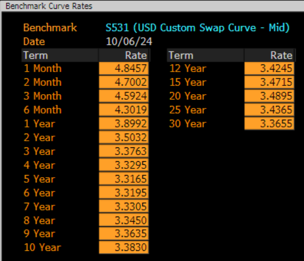
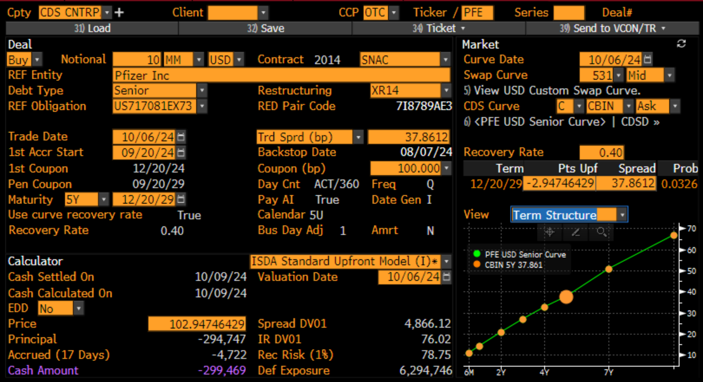

.. _cook-cdsw-doc:

.. ipython:: python
   :suppress:

   from rateslib.curves import *
   from rateslib.instruments import *
   from rateslib.calendars import add_tenor
   from rateslib.solver import Solver
   from rateslib import defaults
   import matplotlib.pyplot as plt
   from datetime import datetime as dt
   import numpy as np
   from pandas import DataFrame, option_context
   defaults.reset_defaults()

Replicating a Pfizer Default Curve & CDS from Bloomberg's CDSW
*****************************************************************

.. raw:: html

   

     
   

Some collected data at a point in time on Friday 4th Oct 2024 can be loaded into the CDSW function in Bloomberg
for the single security Pfizer US, with the intention of pricing and risking a 5Y Pfizer CDS.
The raw data necessary to build the curves and replicate the pricing risk metrics is added to Python.
(Some of the loaded CDS data is also shown in an image at the bottom of this page)

.. ipython:: python

   irs_tenor = ["1m", "2m", "3m", "6m", "12m", "2y", "3y", "4y", "5y", "6y", "7y", "8y", "9y", "10y", "12y"]
   irs_rates = irs_rates = [4.8457, 4.7002, 4.5924, 4.3019, 3.8992, 3.5032, 3.3763, 3.3295, 3.3165, 3.3195, 3.3305, 3.3450, 3.3635, 3.3830, 3.4245]
   cds_tenor = ["6m", "12m", "2y", "3y", "4y", "5y", "7y", "10y"]
   cds_rates = [0.11011, 0.14189, 0.20750, 0.26859, 0.32862, 0.37861, 0.51068, 0.66891]

Since the SOFR curve is a rates component, independent from the Pfizer credit component, we will build that,
separately, first. This is no different to any of the other tutorials or examples constructing a basic
SOFR curve - it places node dates at the maturity of each IRS and solves the curve with exact precision.

.. ipython:: python

   today = dt(2024, 10, 4)  # Friday 4th October 2024
   spot = dt(2024, 10, 8)  # Tuesday 8th October 2024

   disc_curve = Curve(
       nodes={
           today: 1.0,
           **{add_tenor(spot, _, "mf", "nyc"): 1.0 for _ in irs_tenor}
       },
       calendar="nyc",
       convention="act360",
       interpolation="log_linear",
       id="sofr"
   )

   us_rates_sv = Solver(
       curves=[disc_curve],
       instruments=[
           IRS(spot, _, spec="usd_irs", curves="sofr") for _ in irs_tenor
       ],
       s=irs_rates,
       instrument_labels=irs_tenor,
       id="us_rates"
   )

This framework for:

- **firstly,** structuring a *Curve* with chosen hyper-parameters such as *nodes*, *interpolation*, etc.,
- **secondly,** calibrating that *Curve* with a chosen set of market *Instruments*,

should now be familiar. Here we will create a hazard *Curve* for Pfizer using node dates at constant tenor points
(notice these are **not** the maturity of the so called *credit-imm dates* - but they could be if you wanted) and
then calibrate the curve with proper CDS market instruments and prices.

.. ipython:: python

   cds_eff = dt(2024, 9, 20)
   cds_mats = [add_tenor(dt(2024, 12, 20), _, "mf", "all") for _ in cds_tenor]

   hazard_curve = Curve(
       nodes={
           today: 1.0,
           **{add_tenor(spot, _, "mf", "nyc"): 1.0 for _ in cds_tenor}
       },
       calendar="all",
       convention="act365f",
       interpolation="log_linear",
       id="pfizer"
   )

   pfizer_sv = Solver(
       curves=[hazard_curve],
       pre_solvers=[us_rates_sv],
       instruments=[
           CDS(cds_eff, _, frequency="Q", calendar="nyc", curves=["pfizer", "sofr"]) for _ in cds_mats
       ],
       s=cds_rates,
       instrument_labels=cds_tenor,
       id="pfizer_cds"
   )

Lets look at the structure of the hazard rates generated. To do this we plot the *'1d'* overnight rates of the
*'pfizer'* hazard curve.

.. ipython:: python

   hazard_curve.plot("1d")

.. plot::

   from rateslib import *
   import matplotlib.pyplot as plt
   irs_tenor = ["1m", "2m", "3m", "6m", "12m", "2y", "3y", "4y", "5y", "6y", "7y", "8y", "9y", "10y", "12y"]
   irs_rates = irs_rates = [4.8457, 4.7002, 4.5924, 4.3019, 3.8992, 3.5032, 3.3763, 3.3295, 3.3165, 3.3195, 3.3305, 3.3450, 3.3635, 3.3830, 3.4245]
   cds_tenor = ["6m", "12m", "2y", "3y", "4y", "5y", "7y", "10y"]
   cds_rates = [0.11011, 0.14189, 0.20750, 0.26859, 0.32862, 0.37861, 0.51068, 0.66891]
   today = dt(2024, 10, 4)  # Friday 4th October 2024
   spot = dt(2024, 10, 8)  # Tuesday 8th October 2024
   disc_curve = Curve(
       nodes={
           today: 1.0,
           **{add_tenor(spot, _, "mf", "nyc"): 1.0 for _ in irs_tenor}
       },
       calendar="nyc",
       convention="act360",
       interpolation="log_linear",
       id="sofr"
   )
   us_rates_sv = Solver(
       curves=[disc_curve],
       instruments=[
           IRS(spot, _, spec="usd_irs", curves="sofr") for _ in irs_tenor
       ],
       s=irs_rates,
       instrument_labels=irs_tenor,
       id="us_rates"
   )
   cds_eff = dt(2024, 9, 20)
   cds_mats = [add_tenor(dt(2024, 12, 20), _, "mf", "all") for _ in cds_tenor]
   hazard_curve = Curve(
       nodes={
           today: 1.0,
           **{add_tenor(spot, _, "mf", "nyc"): 1.0 for _ in cds_tenor}
       },
       calendar="all",
       convention="act365f",
       interpolation="log_linear",
       id="pfizer"
   )
   pfizer_sv = Solver(
       curves=[hazard_curve],
       pre_solvers=[us_rates_sv],
       instruments=[
           CDS(cds_eff, _, frequency="Q", calendar="nyc", curves=["pfizer", "sofr"]) for _ in cds_mats
       ],
       s=cds_rates,
       instrument_labels=cds_tenor,
       id="pfizer_cds"
   )
   fig, ax, line = hazard_curve.plot("1d", labels=["Pfizer Hazard Rate"])
   plt.show()
   plt.close()

By definition, the probabilities of survival are calculable directly from the hazard *Curve*.

.. ipython:: python

   hazard_curve[dt(2025, 10, 4)]  # Probability Pfizer survives at least 1yr.
   hazard_curve[dt(2029, 10, 4)]  # Probability Pfizer survives at least 5yr.
   hazard_curve[dt(2034, 10, 4)]  # Probability Pfizer survives at least 10yr.

Pricing and risk metrics are calculable within *rateslib's* natural framework. Let's build the traditional
5Y Pfizer CDS and compare the numbers to Bloombergs calculator (these may not necessarily be exactly the same due to
different hyper-parameter choices for the curves and any pricing rounding, including discretization choices for the
numerical integrations of CDS protection and premium legs).

.. ipython:: python

   cds = CDS(
       effective=dt(2024, 9, 20),
       termination=dt(2029, 12, 20),
       frequency="q",
       convention="act360",
       calendar="nyc",
       curves=["pfizer", "sofr"],
       fixed_rate=1.0,
       recovery_rate=0.4,
       premium_accrued=True,
       notional=10e6,
   )
   cds.rate(solver=pfizer_sv)  # this compares to BBG: "Trd Sprd (bp)"
   cds.npv(solver=pfizer_sv)  # this compares to BBG: "Cash Amount"
   cds.analytic_delta(hazard_curve, disc_curve)
   cds.accrued(dt(2024, 10, 7))  # this is 17 days of accrued
   cds.delta(solver=pfizer_sv).groupby("solver").sum()  # this compares to: "Spread DV01" and "IR DV01"

