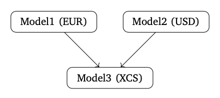

.. _cook-depchain-doc:

.. ipython:: python
   :suppress:

   from rateslib.curves import *
   from rateslib.instruments import *
   import matplotlib.pyplot as plt
   from datetime import datetime as dt
   import numpy as np
   from pandas import DataFrame

Solving Curves with a Dependency Chain
******************************************************

In real trading environments market-makers and brokers are typically responsible
for creating and maintaining their own curves. Normally different teams are
responsible for the pricing of different instruments. Some instruments and curves
are only dependent upon their local environment, for which a team will have complete
visibility. Other instruments might be dependent upon pre-requisite markets to
price instruments exactly.

A good example is local currency interest rate curves defined by IRS prices, and
cross-currency curves defined by XCS prices but dependent upon FX rates and local
currency IRS curves.

Below, for demonstration purposes we present a minimalist example of a
dependency chain constructing
EUR and USD interest curves independently and then using them to price a
cross-currency model.

The EUR Curve
=============

The EUR curve is configured and constructed by the EUR IRS team. That team can
determine that model in any way they choose.

In the below configuration they have a **log linear** curve with nodes on 1st May and 1st Jan
next year, and these are calibrated exactly with 4M and 1Y swaps whose values are 2% and 2.5%.

.. ipython:: python

   eureur = Curve(
       nodes={
           dt(2022, 1, 1): 1.0,
           dt(2022, 5, 1): 1.0,
           dt(2023, 1, 1): 1.0,
       },
       convention="act360",
       calendar="tgt",
       interpolation="log_linear",
       id="eureur",
   )
   eur_kws = dict(
       effective=dt(2022, 1, 3),
       spec="eur_irs",
       curves="eureur",
   )
   eur_solver = Solver(
       curves=[eureur],
       instruments=[
           IRS(**eur_kws, termination="4M"),
           IRS(**eur_kws, termination="1Y"),
       ],
       s=[2.0, 2.5],
       id="eur"
   )

The USD Curve
=============

The same for the USD IRS team. Notice that this model is slightly different for
purposes of example. They have a node at the 7M point and also a 7M swap.

.. ipython:: python

   usdusd = Curve(
       nodes={
           dt(2022, 1, 1): 1.0,
           dt(2022, 8, 1): 1.0,
           dt(2023, 1, 1): 1.0,
       },
       convention="act360",
       calendar="nyc",
       interpolation="log_linear",
       id="usdusd",
   )
   usd_kws = dict(
       effective=dt(2022, 1, 3),
       spec="usd_irs",
       curves="usdusd",
   )
   usd_solver = Solver(
       curves=[usdusd],
       instruments=[
           IRS(**usd_kws, termination="7M"),
           IRS(**usd_kws, termination="1Y"),
       ],
       s=[4.0, 4.8],
       id="usd"
   )

The XCS Curve
==============

The XCS team are then able to rely on these curves, trusting a
construction from their colleagues. The configuration of the XCS curves is
freely chosen by this team. In the configuration the the only linking arguments are
the ``pre_solver`` argument and the string id ``curves`` references in the instrument
initialisation. An :class:`~rateslib.fx.FXForwards` object is also created from all
the constructed curves to price forward FX rates for the instruments.

.. ipython:: python

   fxr = FXRates({"eurusd": 1.10}, settlement=dt(2022, 1, 3))
   eurusd = Curve(
       nodes={
           dt(2022, 1, 1): 1.0,
           dt(2022, 5, 1): 1.0,
           dt(2022, 9, 1): 1.0,
           dt(2023, 1, 1): 1.0,
       },
       convention="act360",
       calendar=None,
       interpolation="log_linear",
       id="eurusd",
   )
   fxf = FXForwards(
       fx_rates=fxr,
       fx_curves={
           "usdusd": usdusd,
           "eureur": eureur,
           "eurusd": eurusd,
       }
   )
   xcs_kws = dict(
       effective=dt(2022, 1, 3),
       spec="eurusd_xcs",
       curves=["eureur", "eurusd", "usdusd", "usdusd"]
   )
   xcs_solver = Solver(
       pre_solvers=[eur_solver, usd_solver],
       fx=fxf,
       curves=[eurusd],
       instruments=[
           XCS(**xcs_kws, termination="4m"),
           XCS(**xcs_kws, termination="8m"),
           XCS(**xcs_kws, termination="1y"),
       ],
       s=[-5.0, -6.5, -11.0],
       id="eur/usd",
   )

Back to the EUR Team
====================

If the EUR team would now need to value and risk an arbitrary swap they are able to
do that within their own local model.

.. ipython:: python

   irs = IRS(**eur_kws, termination="9M", fixed_rate=1.15, notional=100e6)
   irs.npv(solver=eur_solver)
   irs.delta(solver=eur_solver)

Since their curves are used within the XCS framework this will give precisely the same
result if it taken from their model.

.. ipython:: python

   irs.npv(solver=xcs_solver)
   irs.delta(solver=xcs_solver)

This framework can advance the cause of the EUR team if the swap is
collateralised in another currency. For this, the XCS model is definitely required and
can be referred to directly:

.. ipython:: python

   irs.curves = ["eureur", "eurusd"]  # <- changing to a USD CSA for this swap.
   irs.npv(solver=xcs_solver)
   irs.delta(solver=xcs_solver)

Thus the framework is completely consistent and customisable for all teams to use as
required.
