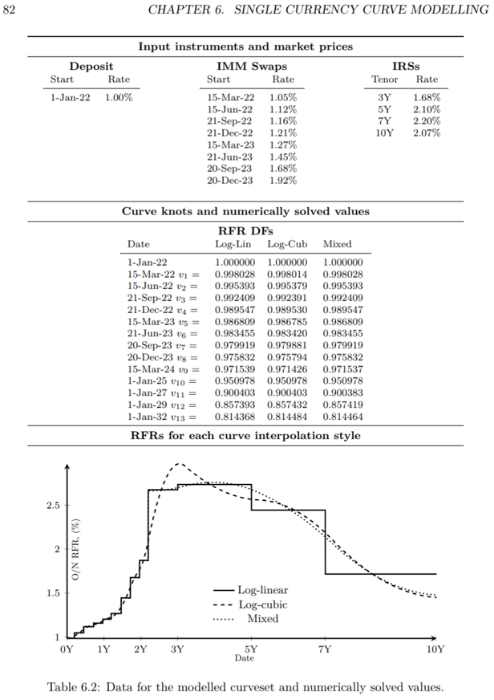

.. _cook-ptirds-curve-doc:

.. ipython:: python
   :suppress:

   from rateslib.curves import *
   from rateslib.instruments import *
   import matplotlib.pyplot as plt
   from datetime import datetime as dt
   import numpy as np
   from pandas import DataFrame, option_context

Replicating the Single Currency Curve in Pricing and Trading Interest Rate Derivatives
*******************************************************************************************

In `Pricing and Trading Interest Rate Derivatives: A Practical Guide to Swaps <https://www.amazon.com/Pricing-Trading-Interest-Rate-Derivatives/dp/0995455538>`_
an example is given in *Chapter 6: Single Currency Curve Modelling* of a curve that uses IMM instruments.
Different modes of interpolation are exemplified in the *Table 6.2*, and this page will show how to replicate
those curves using *rateslib*.

First, here is a screenshot of the data from *Table 6.2*. Since no details of any of the conventions are stated
in the data we will assume that it is constructed with:

- Convention: *"Act365F"*,
- Calendar: *"all"* (which is all days and no holidays)
- Frequency: *"A"*

The **nodes** needed for this curve are directly specified. We will build a *Curve* factory function
below so that it is easier later to build all the *Curves* with different interpolation.

.. ipython:: python

   def curve_factory(interpolation, t):
       return Curve(
           nodes={
               dt(2022, 1, 1): 1.0,
               dt(2022, 3, 15): 1.0,
               dt(2022, 6, 15): 1.0,
               dt(2022, 9, 21): 1.0,
               dt(2022, 12, 21): 1.0,
               dt(2023, 3, 15): 1.0,
               dt(2023, 6, 21): 1.0,
               dt(2023, 9, 20): 1.0,
               dt(2023, 12, 20): 1.0,
               dt(2024, 3, 15): 1.0,
               dt(2025, 1, 1): 1.0,
               dt(2027, 1, 1): 1.0,
               dt(2029, 1, 1): 1.0,
               dt(2032, 1, 1): 1.0,
           },
           convention="act365f",
           calendar="all",
           interpolation=interpolation,
           t=t,
       )

To calibrate the *Curves* the *Instruments* are all swaps an their *effective* and *termination* dates only
need to be properly input. Their *rates* are also given.
Below we make a *Solver* factory function so that later we can solve different *Curves* without having to repeat all
the code and the setup.

.. ipython:: python

   def solver_factory(curve):
       args = dict(calendar="all", frequency="a", convention="act365f", payment_lag=0, curves=curve)
       return Solver(
           curves=[curve],
           instruments=[
               # Deposit
               IRS(dt(2022, 1, 1), "1b", **args),
               # IMMs
               IRS(dt(2022, 3, 15), dt(2022, 6, 15), **args),
               IRS(dt(2022, 6, 15), dt(2022, 9, 21), **args),
               IRS(dt(2022, 9, 21), dt(2022, 12, 21), **args),
               IRS(dt(2022, 12, 21), dt(2023, 3, 15), **args),
               IRS(dt(2023, 3, 15), dt(2023, 6, 21), **args),
               IRS(dt(2023, 6, 21), dt(2023, 9, 20), **args),
               IRS(dt(2023, 9, 20), dt(2023, 12, 20), **args),
               IRS(dt(2023, 12, 20), dt(2024, 3, 15), **args),
               # Swaps
               IRS(dt(2022, 1, 1), "3y", **args),
               IRS(dt(2022, 1, 1), "5y", **args),
               IRS(dt(2022, 1, 1), "7y", **args),
               IRS(dt(2022, 1, 1), "10y", **args)
           ],
           s=[
               # Deposit
               1.0,
               # IMMS
               1.05,
               1.12,
               1.16,
               1.21,
               1.27,
               1.45,
               1.68,
               1.92,
               # Swaps
               1.68,
               2.10,
               2.20,
               2.07
           ]
       )

We will now build and solve the three *Curves* with the different types of interpolation to match
the book's values.
In order to add log cubic spline interpolation we only need to add the *knot sequence* as the
``t`` parameter.

.. ipython:: python

   log_linear_curve = curve_factory("log_linear", NoInput(0))
   log_cubic_curve = curve_factory("spline", NoInput(0))
   mixed_curve = curve_factory("log_linear", t=[dt(2024, 3, 15), dt(2024, 3, 15), dt(2024, 3, 15), dt(2024, 3, 15), dt(2025, 1, 1), dt(2027, 1, 1), dt(2029, 1, 1), dt(2032, 1, 1), dt(2032, 1, 1), dt(2032, 1, 1), dt(2032, 1, 1)])

.. ipython:: python

   solver_factory(log_linear_curve)
   solver_factory(log_cubic_curve)
   solver_factory(mixed_curve)

The discount factors for each *Curve* are stated as below:

.. ipython:: python

   df = DataFrame(
       index=[_ for _ in log_linear_curve.nodes.keys],
       data={
           "log-linear": [float(_) for _ in log_linear_curve.nodes.values],
           "log-cubic": [float(_) for _ in log_cubic_curve.nodes.values],
           "mixed": [float(_) for _ in mixed_curve.nodes.values],
       }
   )
   with option_context("display.float_format", lambda x: '%.6f' % x):
       print(df)

The *Curves* are plotted.

.. ipython:: python

   log_linear_curve.plot("1b", comparators=[log_cubic_curve, mixed_curve], labels=["log_linear", "log_cubic", "mixed"])

.. plot:: plot_py/ptirds.py

   The same graph as shown in Pricing and Trading Interest Rate Derivatives (Table 6.2)
