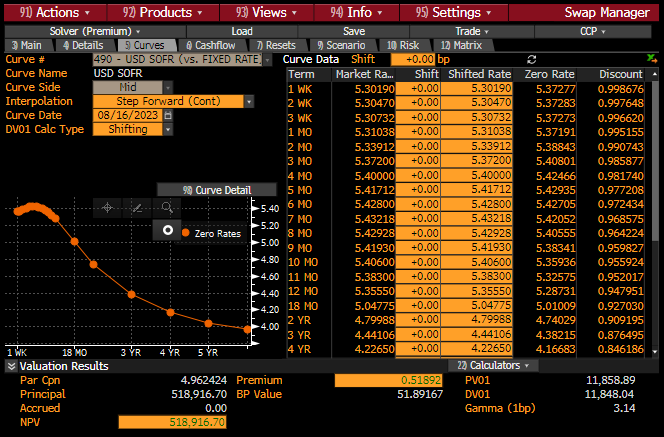
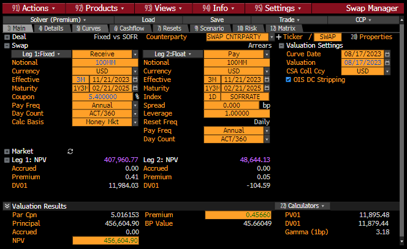
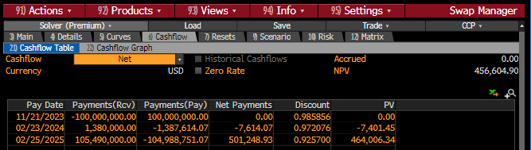

.. _cook-swpm-doc:

.. ipython:: python
   :suppress:

   from rateslib.curves import *
   from rateslib.instruments import *
   import matplotlib.pyplot as plt
   from datetime import datetime as dt
   import numpy as np
   from pandas import DataFrame, option_context

Replicating a SOFR Curve & Swap from Bloomberg's SWPM
******************************************************

At a point in time on Thu 17th Aug 2023 loading the SWPM function in Bloomberg
presented the following default SOFR curve data:

We can replicate the input data for the :class:`~rateslib.curves.Curve` in a table as follows:

.. ipython:: python

   data = DataFrame({
       "Term": ["1W", "2W", "3W", "1M", "2M", "3M", "4M", "5M", "6M", "7M", "8M", "9M", "10M", "11M", "12M", "18M", "2Y", "3Y", "4Y"],
       "Rate": [5.30111, 5.30424, 5.30657, 5.31100, 5.34800, 5.38025, 5.40915, 5.43078, 5.44235, 5.44950, 5.44878, 5.44100, 5.42730, 5.40747, 5.3839, 5.09195, 4.85785, 4.51845, 4.31705],
   })
   data["Termination"] = [add_tenor(dt(2023, 8, 21), _, "F", "nyc") for _ in data["Term"]]
   with option_context("display.float_format", lambda x: '%.6f' % x):
       print(data)

Bloomberg defaults to a "Step Forward (cont)" ``interpolation`` mode, this is effectively the
same as "log_linear" in *rateslib's* formulation for *Curves*. We will configure DF
``nodes`` dates to be on the termination date of the swaps:

.. ipython:: python

   sofr = Curve(
       id="sofr",
       convention="Act360",
       calendar="nyc",
       modifier="MF",
       interpolation="log_linear",
       nodes={
           **{dt(2023, 8, 17): 1.0},  # <- this is today's DF,
           **{_: 1.0 for _ in data["Termination"]},
       }
   )

Now we will calibrate the curve to the given swap market prices, using a global
:class:`~rateslib.solver.Solver`, passing in the calibrating instruments and rates.

.. ipython:: python

   sofr_args = dict(effective=dt(2023, 8, 21), spec="usd_irs", curves="sofr")
   solver = Solver(
       curves=[sofr],
       instruments=[IRS(termination=_, **sofr_args) for _ in data["Termination"]],
       s=data["Rate"],
       instrument_labels=data["Term"],
       id="us_rates",
   )
   data["DF"] = [float(sofr[_]) for _ in data["Termination"]]
   with option_context("display.float_format", lambda x: '%.6f' % x):
       print(data)

Notice that the DFs are the same as those in SWPM (at least to a visible 1e-6 tolerance).

Next we will create a swap in SWPM and also create the same swap in *rateslib*.
The metrics that SWPM and *rateslib* generate for *npv*, *delta* (DV01), *gamma* and
*analytic delta* (PV01) are the same to within a very small tolerance.

.. ipython:: python

   irs = IRS(
       effective=dt(2023, 11, 21),
       termination=dt(2025, 2, 21),
       notional=-100e6,
       fixed_rate=5.40,
       curves="sofr",
       spec="usd_irs",
   )
   irs.npv(solver=solver)
   irs.delta(solver=solver).sum()
   irs.gamma(solver=solver).sum().sum()
   irs.analytic_delta(curve=sofr)

Finally we can double check the *cashflows* and *cashflows_table* of the swap.

.. ipython:: python

   irs.cashflows_table(solver=solver)
   irs.cashflows(solver=solver)
