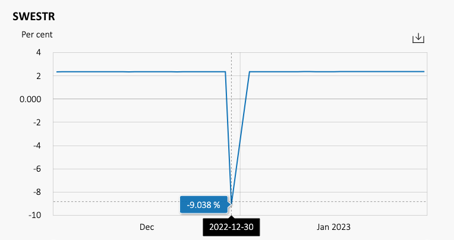

.. _cook-turns-doc:

.. ipython:: python
   :suppress:

   from rateslib.curves import *
   from rateslib.instruments import *
   import matplotlib.pyplot as plt
   from datetime import datetime as dt
   import numpy as np
   from pandas import DataFrame, option_context

How to Handle Turns in Rateslib
******************************************************

Turns are an artifact present on interest rate curves that reflect a genuine
economic effect. To an outsider these often look like discontinuities,
outliers, or erroneous data. But, they are an accurate reflection of reality, and should always
be included.

The following image is an example of an index, the Riksbank's SWESTR, which is
impacted to an excessive degree by the government's fiscal policy of applying taxes and fees
based on the size of a
Swedish bank's liabilities at year end. In order to either shrink its liabilities or accrue an
amount from a depositor that covers the fee, a Swedish bank adjusts its overnight deposit rate
for this one day of the year. Because of the scale, any daily variation of regular amplitude
at around 2.30%-2.31% is not visible and the curve appears completely flat, but it is not. Data
is available on the
`Riksbank's website <https://www.riksbank.se/en-gb/statistics/swestr/search-swestr/>`_.

These present challenges when constructing curves, however. Consider the following
:class:`~rateslib.curves.Curve`, which from 1st Dec '22 to 31st Jan '23 is a flat curve
with overnight rates at 1%.

.. ipython:: python

   curve = Curve({dt(2022, 12, 1): 1.0, dt(2023, 1, 31): 1.0}, id="v")
   solver = Solver(
       curves=[curve],
       instruments=[IRS(dt(2022, 12, 1), "1b", "A", curves=curve)],
       s=[1.0],
   )

For the next part, when we add a turn, we will compare back to this curve. So,
for the record, three relevant discount factors (DFs) on it are:

.. ipython:: python

   curve[dt(2022, 12, 31)]
   curve[dt(2023, 1, 1)]
   curve[dt(2023, 1, 31)]

When we add a year-end turn to this curve we are going to need to insert two
degrees of freedom. At the moment, the curve only has one; the rate between
1st Dec '22 and 31st Jan '23. But with the addition of a turn it will have three; the
rate before the turn, the rate of the turn, and the rate after the turn.
We can make those changes:

.. ipython:: python

   curve = Curve(
       {dt(2022, 12, 1): 1.0, dt(2022, 12, 31): 1.0, dt(2023, 1, 1): 1.0, dt(2023, 1, 31): 1.0},
       id="x",
   )
   solver = Solver(
       curves=[curve],
       instruments=[
           IRS(dt(2022, 12, 1), "1b", "A", curves=curve),
           IRS(dt(2022, 12, 31), "1b", "A", curves=curve),
           IRS(dt(2023, 1, 1), "1b", "A", curves=curve),
       ],
       s=[1.0, -2.0, 1.0],
   )

Now this *Curve* has flat rates at 1% everywhere except for the year end date, which
is -2%. Consider the DFs after this new addition:

.. ipython:: python

   curve[dt(2022, 12, 31)]
   curve[dt(2023, 1, 1)]
   curve[dt(2023, 1, 31)]

The common mathematical principle here is that the DFs upto 31st Dec '22 are the
same as before. But, after the turn, all of the DFs are adjusted by a
multiplicative constant. This is consistent with
`Ametrano & Bianchetti (2013) <https://papers.ssrn.com/sol3/papers.cfm?abstract_id=2219548>`_.

In this case, because this *Curve* had **log-linear interpolation**, it was quite easy to calibrate
it. Things get more complicated when the *Curve* wants an interpolation style which demands
smoothness, such as **log-cubic spline**.

If we naively try to add log-cubic spline interpolation to the above setup things will not go well
in *rateslib* (or any other curve building software). The curve will try to adapt to the
excessive turn and diverge/oscillate away to 50% rates.
The mathematical concept of the multiplicative constant, however, is still valid, but this
would require the Python class (in this case a *Curve*) to be constructed with an inherent overlay
of DF adjustments when including turns. This is a very specific coding requirement and does not
readily suit an environment that is otherwise completely generalist. It would add significant
cyclomatic complexity to the code and also cognitive complexity. It would also considerably
slow down the *Curve* lookup. So *rateslib* does not do this.

*Rateslib's* way of handling this, instead, is to provide a :class:`~rateslib.curves.CompositeCurve`
class, which stores a record of different curves and allows it to return rates that are some
operations of a combination of other curves. This operation can be quite general
(see :class:`~rateslib.curves.MultiCsaCurve` for example) and is not restricted to just serving the
interest of turns by providing a multiplicative DF constant at appropriate points.

First we can create a *Curve* with just the turn effect embedded. In this case a bump of -3% to
the end of year date. The below curve has rates at 0% everywhere except for the year end date.
When composited with another *Curve* under vector addition all of the rates at 0% will have no
effect, whilst the the single -3% value will:

.. ipython:: python

   turn_curve = Curve(
       {dt(2022, 12, 1): 1.0, dt(2022, 12, 31): 1.0, dt(2023, 1, 1): 1.0, dt(2023, 1, 31): 1.0}
   )
   turn_solver = Solver(
       curves=[turn_curve],
       instruments=[
           IRS(dt(2022, 12, 1), "1b", "A", curves=turn_curve),
           IRS(dt(2022, 12, 31), "1b", "A", curves=turn_curve),
           IRS(dt(2023, 1, 1), "1b", "A", curves=turn_curve),
       ],
       s=[0.0, -3.0, 0.0],
   )

Then we can create a log-cubic curve, with knot points in any valid locations we want and
composite this with the turn *Curve*. Just to be able to display a little more variation instead of
a flat curve, a few more rates have been added to create some semblance of shape.

.. ipython:: python

   log_cubic_curve = Curve(
       {dt(2022, 12, 1): 1.0, dt(2022, 12, 20): 1.0, dt(2023, 1, 10): 1.0, dt(2023, 1, 31): 1.0},
       t=[
          dt(2022, 12, 1), dt(2022, 12, 1), dt(2022, 12, 1), dt(2022, 12, 1),
          dt(2022, 12, 15),
          dt(2023, 1, 15),
          dt(2023, 1, 31), dt(2023, 1, 31), dt(2023, 1, 31), dt(2023, 1, 31)
       ],
   )
   composite_curve = CompositeCurve([log_cubic_curve, turn_curve])
   solver = Solver(
       curves=[log_cubic_curve, composite_curve],
       pre_solvers=[turn_solver],
       instruments=[
           IRS(dt(2022, 12, 1), "1b", "A", curves=composite_curve),
           IRS(dt(2022, 12, 20), "1b", "A", curves=composite_curve),
           IRS(dt(2023, 1, 10), "1b", "A", curves=composite_curve),
       ],
       s=[1.0, 1.2, 1.0],
   )
   composite_curve.plot("1b", labels=["CompositeCurve"])

.. plot::

   from rateslib import *
   import matplotlib.pyplot as plt
   turn_curve = Curve(
       {dt(2022, 12, 1): 1.0, dt(2022, 12, 31): 1.0, dt(2023, 1, 1): 1.0, dt(2023, 1, 31): 1.0}
   )
   turn_solver = Solver(
       curves=[turn_curve],
       instruments=[
           IRS(dt(2022, 12, 1), "1b", "A", curves=turn_curve),
           IRS(dt(2022, 12, 31), "1b", "A", curves=turn_curve),
           IRS(dt(2023, 1, 1), "1b", "A", curves=turn_curve),
       ],
       s=[0.0, -3.0, 0.0],
   )
   log_cubic_curve = Curve(
       {dt(2022, 12, 1): 1.0, dt(2022, 12, 20): 1.0, dt(2023, 1, 10): 1.0, dt(2023, 1, 31): 1.0},
       t=[
          dt(2022, 12, 1), dt(2022, 12, 1), dt(2022, 12, 1), dt(2022, 12, 1),
          dt(2022, 12, 15),
          dt(2023, 1, 15),
          dt(2023, 1, 31), dt(2023, 1, 31), dt(2023, 1, 31), dt(2023, 1, 31)
       ],
   )
   composite_curve = CompositeCurve([log_cubic_curve, turn_curve])
   solver = Solver(
       curves=[log_cubic_curve, composite_curve],
       pre_solvers=[turn_solver],
       instruments=[
           IRS(dt(2022, 12, 1), "1b", "A", curves=composite_curve),
           IRS(dt(2022, 12, 20), "1b", "A", curves=composite_curve),
           IRS(dt(2023, 1, 10), "1b", "A", curves=composite_curve),
       ],
       s=[1.0, 1.2, 1.0],
   )
   fig, ax, line = composite_curve.plot("1b", labels=["CompositeCurve"])
   plt.show()
   plt.close()

The Tesla logo is obviously inspired by Swedish design!
